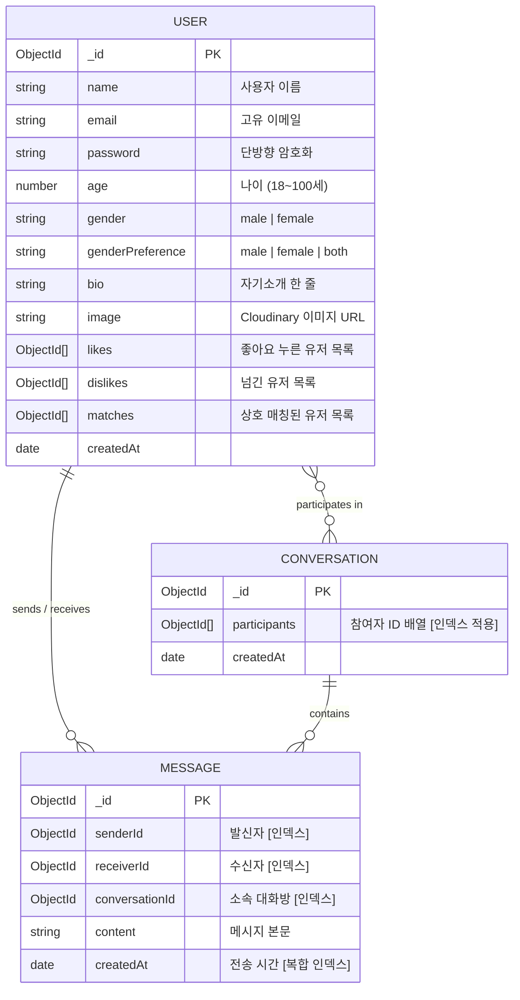

# 🔥 Tinder Clone (Web & Mobile Fullstack)

> **실시간 상호 매칭, 1:1 라이브 채팅, 다중 기기(웹/모바일) 동기화 및 실시간 프로필 갱신을 완벽히 제공하는 크로스 플랫폼 풀스택 틴더 클론 애플리케이션입니다.**  
> 웹 브라우저(React 19 + Vite)와 스마트폰 네이티브 앱(React Native + Expo SDK 57)이 **단일 통합 백엔드(Node.js + Express + MongoDB + Socket.IO)**를 공유하여 완벽하게 상호 연동됩니다.

---

## 📌 목차
1. [🌟 프로젝트 아키텍처 및 개요](#1-프로젝트-아키텍처-및-개요)
2. [🛠️ 기술 스택 (Tech Stack)](#2-기술-스택-tech-stack)
   - [⚙️ Backend 기술 스택](#-backend-기술-스택)
   - [🖥️ Frontend (Web) 기술 스택](#️-frontend-web-기술-스택)
   - [📱 Mobile (App) 기술 스택](#-mobile-app-기술-스택)
3. [📁 프로젝트 디렉토리 구조 상세](#3-프로젝트-디렉토리-구조-상세)
   - [3.1 ⚙️ Backend (`backend/`) 상세 구조 및 역할](#31-️-backend-backend-상세-구조-및-역할)
   - [3.2 🖥️ Frontend Web (`frontend/`) 상세 구조 및 역할](#32-️-frontend-web-frontend-상세-구조-및-역할)
   - [3.3 📱 Mobile App (`mobile/`) 상세 구조 및 역할](#33--mobile-app-mobile-상세-구조-및-역할)
4. [⚡ 핵심 실시간 아키텍처 및 최적화 기능](#4-핵심-실시간-아키텍처-및-최적화-기능)
   - [1) 다중 디바이스(Multi-Device) 소켓 관리 및 완벽한 온라인 상태 동기화](#1-다중-디바이스multi-device-소켓-관리-및-완벽한-온라인-상태-동기화)
   - [2) 초경량 실시간 프로필 갱신 (Web ⟷ Mobile)](#2-초경량-실시간-프로필-갱신-web--mobile)
   - [3) 하이브리드 JWT 인증 파이프라인 (Cookie + Bearer)](#3-하이브리드-jwt-인증-파이프라인-cookie--bearer)
   - [4) 모바일 스마트 네트워크 자동 감지 (LAN IP & Render 원격 URL)](#4-모바일-스마트-네트워크-자동-감지-lan-ip--render-원격-url)
   - [5) MongoDB 쿼리 및 리렌더링 최적화](#5-mongodb-쿼리-및-리렌더링-최적화)
5. [🗄️ 백엔드 데이터베이스 모델 (MongoDB Schemas)](#5-백엔드-데이터베이스-모델-mongodb-schemas)
6. [⚡ 실시간 웹소켓 (Socket.IO) 이벤트 명세](#6-실시간-웹소켓-socketio-이벤트-명세)
7. [📡 백엔드 REST API 엔드포인트](#7-백엔드-rest-api-엔드포인트)
8. [💻 로컬 개발 환경 설치 및 실행 가이드 (Web & Mobile)](#8-로컬-개발-환경-설치-및-실행-가이드-web--mobile)
9. [🔧 모바일 개발 팁 및 트러블슈팅 FAQ](#9-모바일-개발-팁-및-트러블슈팅-faq)
10. [🚀 Render.com 클라우드 배포 및 슬립 방지](#10-rendercom-클라우드-배포-및-슬립-방지)

---

## 1. 🌟 프로젝트 아키텍처 및 개요

본 프로젝트는 하나의 공통 백엔드(Node.js + Express)에서 **웹 브라우저 클라이언트**와 **모바일 앱 클라이언트**를 동시에 지원하며, 다중 기기 세션 및 실시간 양방향 이벤트 통신을 제공합니다.

```
                         ┌─────────────────────────────┐
                         │   Node.js Express Backend   │
                         │    (REST API + Socket.IO)   │
                         └──────────────┬──────────────┘
                                        │
             ┌──────────────────────────┴──────────────────────────┐
             ▼                                                     ▼
┌─────────────────────────┐                               ┌─────────────────────────┐
│     🖥️ Web Frontend     │                               │      📱 Mobile App      │
│  (React 19 + Vite SPA)  │ ◀────── Realtime Sync ──────▶ │  (Expo SDK 57 + RN 0.86)│
│  • httpOnly 쿠키 인증   │      (Socket.IO / DB)         │  • Bearer 헤더 영구인증 │
│  • 데스크톱/반응형 웹   │                               │  • iOS/Android 네이티브 │
│  • 실시간 피드/채팅 갱신│                               │  • 멀티 디바이스 실시간 │
└─────────────────────────┘                               └─────────────────────────┘
```

---

## 2. 🛠️ 기술 스택 (Tech Stack)

### ⚙️ Backend 기술 스택
| 구분 | 기술 / 라이브러리 | 버전 | 용도 및 특징 |
|---|---|---|---|
| **Runtime** | Node.js | v18+ | ES Modules (`"type": "module"`) 네이티브 환경 |
| **Framework** | Express.js | v5 | RESTful API 라우팅 및 전역 미들웨어 파이프라인 |
| **Database** | MongoDB Atlas + Mongoose | v9 | NoSQL 데이터 모델링, 복합 인덱싱, 단일 `$nin` 쿼리 최적화 |
| **Authentication** | JWT (`jsonwebtoken`), `bcryptjs` | - | 비밀번호 단방향 솔트 해싱, 쿠키 & Bearer 토큰 하이브리드 검증 |
| **Realtime** | Socket.IO Server | v4 | `Set<socketId>` 기반 멀티 디바이스 세션 관리, 방(Room) 기반 메시지 전송, 실시간 프로필/매칭 브로드캐스트 |
| **Media Hosting** | Cloudinary SDK | v2 | 프로필 사진 업로드, 자동 리사이징 및 보안 URL 반환 (안전 삭제 로직 내장) |
| **Keep-Alive** | `cron` | - | Render 무료 인스턴스 15분 비활성 슬립 방지 (14분 주기 자동 헬스체크 Ping) |

---

### 🖥️ Frontend (Web) 기술 스택
| 구분 | 기술 / 라이브러리 | 버전 | 용도 및 특징 |
|---|---|---|---|
| **Core** | React | 19 | 최신 React 컴포넌트 아키텍처 및 훅 기반 UI |
| **Bundler** | Vite | v8 | 초고속 HMR(Hot Module Replacement) 및 프로덕션 번들링 |
| **Routing** | React Router DOM | v7 | SPA 클라이언트 사이드 라우팅 |
| **Styling** | Tailwind CSS | v4 | 유틸리티 퍼스트 CSS, 반응형 Glassmorphism 디자인 |
| **State** | Zustand | v5 | 경량 전역 상태 관리 (유저 세션, 추천 피드, 매칭 목록, 채팅) |
| **Icons** | Lucide React | 최신 | 일관된 모던 벡터 아이콘 세트 |
| **HTTP Client** | Axios | v1.7 | 쿠키 자격증명(`withCredentials: true`) 포함 비동기 API 통신 |
| **Realtime** | Socket.IO Client | v4 | 멀티 디바이스 실시간 이벤트 수신 및 In-place 상태 갱신 |
| **Toast** | React Hot Toast | - | 실시간 매치/메시지 도착 시 부드러운 인앱 팝업 알림 |

---

### 📱 Mobile (App) 기술 스택
| 구분 | 기술 / 라이브러리 | 버전 | 용도 및 특징 |
|---|---|---|---|
| **Framework** | Expo SDK | ~57.0.23 | iOS 및 Android 네이티브 빌드와 최신 API 통합 관리 |
| **Core Engine** | React Native | 0.86.3 | **New Architecture (Fabric 렌더러 + TurboModules)** 기반 60fps 보장 |
| **UI Engine** | React | 19.2.3 | 최신 리액트 코어 엔진 |
| **File Routing** | Expo Router | ~57.0.21 | Next.js 스타일의 파일 기반 라우팅 (`(auth)`, `(tabs)`, `chat/`) |
| **Styling** | NativeWind | ^4.1.23 | Tailwind CSS 문법을 모바일 네이티브 스타일시트로 즉각 변환 |
| **State Store** | Zustand | ^5.0.3 | 보일러플레이트 없는 초경량 전역 스토어 (`useAuthStore`, `useMatchStore` 등) |
| **Storage** | `@react-native-async-storage/async-storage` | 2.2.0 | 스마트폰 내부 저장소에 JWT 토큰 및 로그인 세션을 영구 보존 |
| **Image Engine** | `expo-image` | ~57.0.5 | 고성능 메모리 캐싱 및 빠른 이미지 렌더링 |
| **Image Picker** | `expo-image-picker` | ~57.0.18 | 앨범 권한 요청 및 1:1 사진 크롭/선택 |
| **Vector Icons** | `lucide-react-native` | ^0.475.0 | 모바일 해상도에 최적화된 SVG 기반 경량 아이콘 |
| **Realtime** | `socket.io-client` | ^4.8.1 | 백그라운드/포그라운드 소켓 자동 재연결 및 실시간 동기화 |
| **Safe Area** | `react-native-safe-area-context` | ~5.7.0 | iPhone Dynamic Island, 노치, 하단 홈 인디케이터 영역 보호 |

---

## 3. 📁 프로젝트 디렉토리 구조 상세

```
webMobile-tinder/
├── package.json              # 전체 프로젝트 통합 빌드 및 실행 스크립트
├── render.md                 # Render.com 클라우드 배포 매뉴얼
├── README.md                 # 본 프로젝트 종합 안내 문서
│
├── backend/                  # ⚙️ 3.1 공통 백엔드 (Express + Socket.IO + Mongoose)
├── frontend/                 # 🖥️ 3.2 웹 프론트엔드 (React 19 + Vite SPA)
└── mobile/                   # 📱 3.3 모바일 앱 (Expo SDK 57 + React Native)
```

---

### 3.1 ⚙️ Backend (`backend/`) 상세 구조 및 역할

```
backend/
├── package.json              # 백엔드 패키지 의존성 ("type": "module")
├── .env                      # 환경 변수 (PORT, MONGO_URI, JWT_SECRET, Cloudinary 등)
└── src/
    ├── server.js             # 백엔드 메인 엔트리포인트 (Express + HTTP + Socket.IO)
    │
    ├── controllers/          # 💼 비즈니스 로직 컨트롤러
    │   ├── auth.controller.js     # 회원가입, 로그인, 로그아웃, 현재 세션 검증 & 신규가입 브로드캐스트
    │   ├── match.controller.js    # 추천 프로필 조회(인덱스 최적화), 좋아요/싫어요 스와이프, 상호 매치 판별
    │   ├── message.controller.js  # 1:1 메시지 저장, 대화방 생성/조회 및 룸 기반 실시간 전송
    │   └── user.controller.js     # 프로필 정보 수정 및 변경 사항 전역 실시간 브로드캐스트 (userProfileUpdated)
    │
    ├── middleware/           # 🛡️ 요청 전처리 미들웨어
    │   └── auth.middleware.js     # 쿠키(jwt)와 Bearer 헤더를 순차 검사하는 하이브리드 JWT 검증기
    │
    ├── models/               # 🗄️ MongoDB Mongoose 스키마 모델
    │   ├── user.model.js          # 사용자 모델 (이름, 이메일, 암호화 비밀번호, 나이, 성별, likes/dislikes/matches)
    │   ├── message.model.js       # 메시지 모델 (senderId, receiverId, conversationId, content, 인덱스)
    │   └── conversation.model.js  # 대화방 모델 (participants 배열 및 인덱스)
    │
    ├── routes/               # 🛣️ RESTful API 라우트 엔드포인트
    │   ├── auth.route.js          # /api/auth (signup, login, logout, me)
    │   ├── match.route.js         # /api/matches (user-profiles, swipe-right, swipe-left, matches)
    │   ├── message.route.js       # /api/messages (send, conversation/:userId)
    │   └── user.route.js          # /api/users (update, :userId)
    │
    ├── socket/               # ⚡ 실시간 소켓 서버
    │   └── socket.server.js       # Set<socketId> 기반 다중 디바이스 관리, Room 가입, 온라인 유저 목록 브로드캐스트
    │
    └── utils/                # 🔧 공통 유틸리티
        ├── connDB.js              # MongoDB Atlas 연결 핸들러
        ├── cron.js                # Render 15분 슬립 방지 14분 주기 헬스체크 핑
        ├── file.utils.js          # Cloudinary 이미지 업로드 및 안전 삭제 유틸리티
        └── generateToken.js       # JWT 토큰 생성 및 쿠키 발급
```

---

### 3.2 🖥️ Frontend Web (`frontend/`) 상세 구조 및 역할

```
frontend/
├── package.json              # 프론트엔드 패키지 의존성 및 Vite 스크립트
├── vite.config.js            # Vite 번들러 설정
├── index.html                # SPA 메인 HTML
└── src/
    ├── main.jsx              # React 19 진입점
    ├── App.jsx               # 전역 라우터 분기, 소켓 전역 구독 관리, Toaster 마운트
    ├── index.css             # Tailwind CSS v4 스타일시트
    │
    ├── pages/                # 📄 화면 컴포넌트
    │   ├── HomePage.jsx      # 메인 화면 (매치 사이드바 + 추천 스와이프 카드 + 모바일 반응형 탭)
    │   ├── AuthPage.jsx      # 로그인 및 회원가입 화면
    │   ├── ChatPage.jsx      # 1:1 실시간 대화창 (상대 헤더, 대화 말풍선, 이모지 빠른 입력)
    │   └── ProfilePage.jsx   # 내 프로필 정보 및 사진 수정
    │
    ├── components/           # 🧩 재사용 UI 컴포넌트
    │   ├── Header.jsx        # 상단 네비게이션 바, 로고, 프로필/로그아웃 메뉴
    │   ├── Sidebar.jsx       # 매치된 유저 목록, 실시간 온라인 점(🟢), 안 읽은 메시지(✈️) 뱃지
    │   ├── SwipeCard.jsx     # 마우스/터치 드래그 스와이프 카드 (LIKE / NOPE 스탬프)
    │   ├── NoMoreProfiles.jsx# 추천 프로필 소진 안내 뷰
    │   ├── LoginForm.jsx     # 로그인 폼
    │   ├── SignUpForm.jsx    # 회원가입 폼
    │   └── chat/             # 채팅 전용 컴포넌트 (ChatHeader, MessageList, MessageInput)
    │
    ├── store/                # 📦 Zustand 전역 상태 저장소
    │   ├── useAuthStore.js   # 로그인/회원가입/로그아웃, authUser, Socket 연결, 온라인 유저 목록
    │   ├── useMatchStore.js  # 추천 프로필, 스와이프, 매칭 목록, 프로필 변경/신규가입 실시간 반영
    │   ├── useMessageStore.js# 대화 내역 조회, 메시지 전송, 실시간 새 메시지 수신, 안 읽은 알림 관리
    │   └── useUserStore.js   # 프로필 정보 수정 API 요청
    │
    ├── socket/
    │   └── socket.client.js  # Socket.IO 싱글톤 클라이언트 인스턴스 관리
    │
    └── lib/
        └── axios.js          # Axios 인스턴스 (withCredentials: true)
```

---

### 3.3 📱 Mobile App (`mobile/`) 상세 구조 및 역할

```
mobile/
├── package.json              # 모바일 패키지 의존성 (Expo SDK 57)
├── app.json                  # Expo 앱 메타데이터 및 설정
├── babel.config.js           # NativeWind 바벨 설정
├── tailwind.config.js        # 모바일 Tailwind 테마 설정
├── global.css                # NativeWind CSS 기본 지시문
│
└── src/
    ├── app/                  # 🚀 [Expo Router] 파일 기반 라우팅
    │   ├── _layout.jsx       # 최상위 루트 레이아웃 (QueryClientProvider, Root Stack)
    │   ├── index.jsx         # 엔트리 라우트 (자동 로그인 판별 및 리다이렉트)
    │   │
    │   ├── (auth)/           # 🔒 [인증 라우트 그룹]
    │   │   ├── _layout.jsx   # Stack 레이아웃
    │   │   ├── login.jsx     # 로그인 화면
    │   │   └── signup.jsx    # 회원가입 화면
    │   │
    │   ├── (tabs)/           # 🏠 [메인 하단 탭 그룹]
    │   │   ├── _layout.jsx   # 탭바 레이아웃 (디스커버, 매치&채팅, 프로필) + MatchModal / MessageToast
    │   │   ├── index.jsx     # [디스커버] 추천 프로필 탐색, 실시간 접속자 수, 스와이프 카드
    │   │   ├── matches.jsx   # [매치&채팅] 매치 아바타 목록 + 대화 리스트
    │   │   └── profile.jsx   # [내 프로필] 정보 수정, 앨범 사진 선택, 로그아웃
    │   │
    │   └── chat/             # 💬 [1:1 실시간 대화 라우트]
    │       ├── _layout.jsx   # 독립 Stack 레이아웃
    │       └── [id].jsx      # 실시간 대화 화면 (키보드 회피, 자동 스크롤)
    │
    ├── components/           # 🧩 모바일 재사용 UI 컴포넌트
    │   ├── SwipeCard.jsx     # 터치 제스처 스와이프 프로필 카드
    │   ├── MatchModal.jsx    # 상호 매치 성사 시 전체화면 축하 팝업 모달
    │   ├── MessageToast.jsx  # 상단 인앱 메시지 알림 토스트
    │   └── NoMoreProfiles.jsx# 추천 상대 소진 안내 화면
    │
    ├── store/                # 📦 Zustand 전역 상태 저장소
    │   ├── useAuthStore.js   # 로그인/로그아웃, AsyncStorage 토큰 영구 저장, Socket 관리
    │   ├── useMatchStore.js  # 프로필 탐색, 스와이프, 프로필 변경/신규가입 실시간 반영
    │   ├── useMessageStore.js# 대화 내역 조회, 메시지 전송, 안 읽은 알림 관리
    │   └── useUserStore.js   # 프로필 수정 및 갤러리 이미지 Cloudinary 전송
    │
    ├── constants/
    │   └── theme.js          # 🌐 LAN IP & Render 원격 주소 자동 감지기
    │
    └── lib/
        ├── api.js            # Axios 인스턴스 (AsyncStorage Bearer 토큰 자동 주입)
        └── socket.js         # Socket.IO 모바일 클라이언트 관리
```

---

## 4. ⚡ 핵심 실시간 아키텍처 및 최적화 기능

### 1) 다중 디바이스(Multi-Device) 소켓 관리 및 완벽한 온라인 상태 동기화
- **기존 문제점**: 단일 `socketId` 매핑 시 웹과 모바일에 동시 로그인하면 이전 기기의 소켓 정보가 덮어씌워져, 한쪽에서 로그아웃했을 때 다른 쪽 세션의 온라인 상태가 비정상적으로 유지되거나 반대로 오프라인으로 잘못 표시되는 불일치 발생.
- **해결 및 최적화 (`backend/src/socket/socket.server.js`)**:
  ```javascript
  // Map to store connected users: { [userId]: Set<socketId> }
  const userSocketMap = {};
  ```
  1. 유저 접속 시 `userSocketMap[userId]`에 현재 연결된 모든 기기의 `socket.id`를 `Set`으로 누적 저장.
  2. 소켓 연결 시 `socket.join(userId)`를 실행하여, 유저 전용 방(Room)을 통해 웹과 모바일 기기 모두에 실시간 메시지/매칭 알림이 동시 전송되도록 보장.
  3. 연결 해제 시 해당 기기의 소켓만 제거하며, **모든 연결(`Set.size === 0`)이 종료되었을 때에만 온라인 목록에서 제거**하여 기기간 상태 불일치를 완벽히 해결.

---

### 2) 초경량 실시간 프로필 갱신 (Web ⟷ Mobile)
- 모바일 또는 웹에서 프로필(사진, 이름, 소개글, 나이 등)을 수정하면 백엔드가 `userProfileUpdated` 이벤트를 즉시 브로드캐스트합니다.
- **네트워크 및 메모리 최적화**:
  - 원본 이미지가 아닌 Cloudinary CDN URL 문자열과 변경된 텍스트 필드만 전송되므로 전송 데이터 크기가 **0.5KB 미만**으로 극히 가볍습니다.
  - 클라이언트 스토어(`useMatchStore`)에서 이미 메모리에 로드된 `userProfiles`(피드 카드)와 `matches`(매치 목록)의 해당 `_id` 객체 필드만 즉시 치환(in-place update)하므로 DB 재조회나 화면 깜빡임 없이 즉각 반영됩니다.

---

### 3) 하이브리드 JWT 인증 파이프라인 (Cookie + Bearer)
- **웹 브라우저**: `httpOnly` 보안 쿠키(`req.cookies.jwt`)를 통해 XSS 공격을 방어하고 브라우저 레벨에서 안전하게 인증을 유지합니다.
- **모바일 앱**: `AsyncStorage`에 JWT 토큰을 보관하고, Axios 인터셉터가 모든 요청 헤더에 `Authorization: Bearer <token>`을 부착합니다.
- **백엔드 미들웨어 (`auth.middleware.js`)**: 쿠키와 Bearer 헤더를 순차적으로 검증하여 단 하나의 API 엔드포인트로 웹과 모바일의 인증을 투명하게 처리합니다.

---

### 4) 모바일 스마트 네트워크 자동 감지 (LAN IP & Render 원격 URL)
- 모바일 실물 기기에서 `localhost:3000`에 접속할 수 없는 문제를 해결하기 위해, Metro 번들러의 `Constants.expoConfig.hostUri`에서 개발자 PC의 실제 LAN IP(예: `192.168.x.x`)를 자동으로 추출하여 백엔드 주소를 동적으로 바인딩합니다.
- 원격 배포 시에는 `EXPO_PUBLIC_API_URL` 환경 변수를 최우선 적용합니다.

---

### 5) MongoDB 쿼리 및 리렌더링 최적화
- **단일 `$nin` 배열 병합**: 추천 프로필 조회 시 제외할 ID 목록(`currentUser._id`, `likes`, `dislikes`, `matches`)을 단일 배열로 합쳐 `{ _id: { $nin: excludedIds } }` 조건으로 쿼리하여 DB 파싱 비용 및 인덱스 탐색 성능을 최적화했습니다.
- **Cloudinary 안전 삭제 로직**: `deleteFile` 유틸리티에 Cloudinary URL 포맷 검증을 추가하여 외부 이미지나 비정상 URL에 대한 불필요한 삭제 요청을 방어했습니다.

---

## 5. 🗄️ 백엔드 데이터베이스 모델 (MongoDB Schemas)



---

## 6. ⚡ 실시간 웹소켓 (Socket.IO) 이벤트 명세

| 이벤트명 | 방향 | 페이로드 규격 | 기능 및 설명 |
|---|:---:|---|---|
| `connection` | C ➔ S | `query: { userId }` | 클라이언트 접속 시 `userSocketMap`에 소켓 등록 및 유저 룸(`socket.join(userId)`) 입장 |
| `getOnlineUsers` | S ➔ C | `string[] (userIds)` | 현재 1개 이상의 활성 소켓을 보유한 접속 유저 ID 목록 브로드캐스트 |
| `newMessage` | S ➔ C | `Message Document` | 수신자 룸으로 1:1 메시지 실시간 전달 및 인앱 토스트/뱃지 알림 |
| `newMatch` | S ➔ C | `{ _id, name, image }` | 상호 좋아요 성사 시 상대방 룸으로 실시간 매칭 축하 팝업 모달 트리거 |
| `newUserRegistered`| S ➔ C | `{ _id, name, gender, ... }` | 신규 회원 가입 시 전체 클라이언트의 디스커버 카드 덱 자동 갱신 |
| `userProfileUpdated`| S ➔ C | `{ _id, name, image, bio, age, ... }` | 프로필 수정 시 전체 클라이언트의 추천 카드 및 매치 목록 실시간 In-place 갱신 |
| `disconnect` | C ➔ S | `-` | 소켓 종료 시 Set에서 제거, 잔여 소켓이 0개일 때 온라인 목록에서 제거 |

---

## 7. 📡 백엔드 REST API 엔드포인트

### 🔑 인증 API (`/api/auth`)
- `POST /api/auth/signup`: 회원가입 (쿠키 발급 + 모바일용 JSON 토큰 반환 + 소켓 신규가입 알림)
- `POST /api/auth/login`: 로그인 (쿠키 발급 + 모바일용 JSON 토큰 반환)
- `POST /api/auth/logout`: 세션 만료 및 쿠키 파기
- `GET /api/auth/me`: 현재 로그인 세션 사용자 정보 검증

### 💖 매칭 & 탐색 API (`/api/matches`)
- `GET /api/matches/user-profiles`: 선호 성별에 따른 추천 프로필 카드 목록 (단일 `$nin` 최적화)
- `POST /api/matches/swipe-right/:likedUserId`: 좋아요(Like) 처리 및 상호 매칭 판별 (실시간 `newMatch` 알림)
- `POST /api/matches/swipe-left/:dislikedUserId`: 싫어요(Nope) 처리
- `GET /api/matches`: 현재 매칭된 유저 목록 조회

### 💬 메시지 API (`/api/messages`)
- `POST /api/messages/send`: 1:1 메시지 전송 및 대화방 자동 생성 (실시간 `newMessage` 룸 전송)
- `GET /api/messages/conversation/:userId`: 특정 유저와의 전체 대화 내역 조회

### 👤 사용자 프로필 API (`/api/users`)
- `PUT /api/users/update`: 프로필 정보 수정 및 사진 Cloudinary 업로드 (실시간 `userProfileUpdated` 브로드캐스트)
- `GET /api/users/:userId`: 특정 사용자 상세 정보 조회

---

## 8. 💻 로컬 개발 환경 설치 및 실행 가이드 (Web & Mobile)

### 1) 사전 준비
- **Node.js**: v18 이상
- **스마트폰**: Expo Go 앱 설치 ([iOS App Store](https://apps.apple.com/app/expo-go/id982107779) / [Google Play](https://play.google.com/store/apps/details?id=host.exp.exponent))
- **MongoDB Atlas** 및 **Cloudinary** 계정

### 2) 환경 변수 설정
`backend/.env` 파일을 생성하고 본인의 키를 입력합니다:
```env
PORT=3000
NODE_ENV=development
DEVELOPMENT_URL=http://localhost:5173

# MongoDB Atlas 연결 URI
MONGO_URI=mongodb+srv://<username>:<password>@cluster.mongodb.net/tinder_db?retryWrites=true&w=majority

# JWT 비밀키
JWT_SECRET=your_jwt_secret_key_here

# Cloudinary 설정
CLOUDINARY_CLOUD_NAME=your_cloudinary_name
CLOUDINARY_API_KEY=your_cloudinary_api_key
CLOUDINARY_API_SECRET=your_cloudinary_api_secret
```

### 3) 패키지 일괄 설치
```bash
# 1. 루트 및 프론트엔드 빌드 준비
npm run build

# 2. 모바일 패키지 설치
cd mobile && npm install && cd ..
```

### 4) 동시 실행 (3개의 터미널 창)
```bash
# [터미널 1] 백엔드 서버 구동 (포트 3000)
npm run dev:backend

# [터미널 2] 웹 프론트엔드 구동 (포트 5173)
npm run dev:frontend

# [터미널 3] 모바일 Expo 개발 서버 구동
npm run dev:mobile
```

---

## 9. 🔧 모바일 개발 팁 및 트러블슈팅 FAQ

### Q1. 스마트폰의 Expo Go 앱에서 백엔드 연결이 안 됩니다 (Network Error).
- **해결책**:
  1. 개발 컴퓨터와 스마트폰이 **반드시 동일한 Wi-Fi 공유기**에 연결되어 있어야 합니다.
  2. 기기 간 통신을 차단하는 공용 Wi-Fi의 경우, 스마트폰 핫스팟을 켜서 컴퓨터를 연결하면 100% 정상 작동합니다.
  3. `mobile/src/constants/theme.js`가 LAN IP를 자동 감지하므로 IP를 수동으로 바꿀 필요가 없습니다.

### Q2. 모바일 앱 캐시를 완전히 초기화하고 싶습니다.
```bash
cd mobile
npx expo start --clear
```

### Q3. iOS 시뮬레이터나 Android 에뮬레이터에서 실행하고 싶습니다.
- Expo 터미널에서:
  - `i` 키: **iOS 시뮬레이터** 자동 실행 (Mac + Xcode)
  - `a` 키: **Android 에뮬레이터** 자동 실행 (Android Studio)

---

## 10. 🚀 Render.com 클라우드 배포 및 슬립 방지

백엔드와 웹 프론트엔드는 **Render.com** 무료 웹 서비스에 단 한 번의 설정으로 완벽하게 배포됩니다:

1. **Build Command**: `npm run build`
2. **Start Command**: `npm start`
3. **24시간 슬립 방지 (Keep-Alive Cron)**:
   - 본 프로젝트의 백엔드 내부에는 **14분 주기 크론 핑(`backend/src/utils/cron.js`)**이 기본 내장되어 있어 무료 티어의 15분 비활성 슬립을 막고 24시간 빠른 응답을 유지합니다.
4. **모바일 앱 클라우드 연동**:
   - 배포된 백엔드 URL(`https://<your-app>.onrender.com/api`)을 `mobile/.env`의 `EXPO_PUBLIC_API_URL`에 등록하면, PC 로컬 서버 없이도 스마트폰으로 언제 어디서나 실제 서비스를 사용할 수 있습니다.

> 📖 **더욱 상세한 클라우드 배포 단계별 설명서**는 루트 디렉토리의 **[render.md](./render.md)**를 참고하세요.

---

## 📄 라이선스 (License)
This project is licensed under the [ISC License](./package.json).
