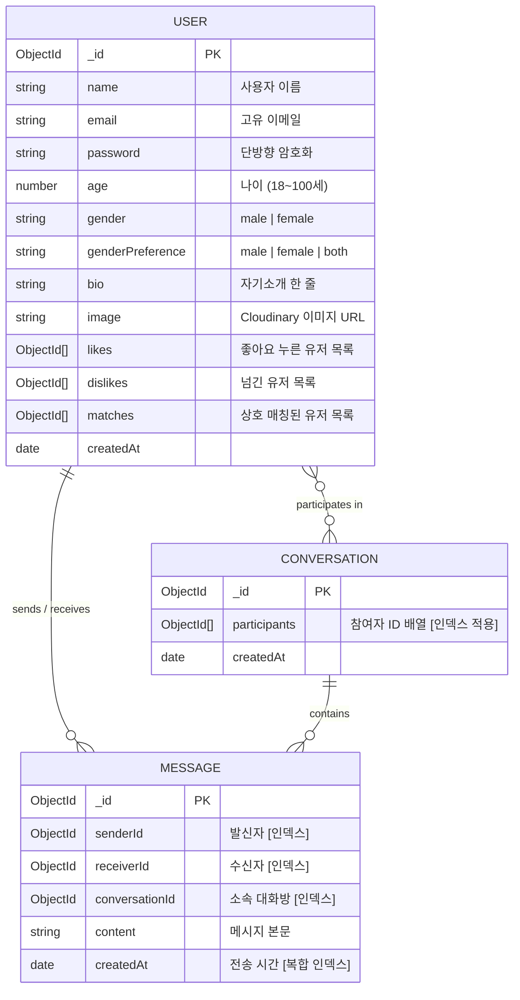

# 🔥 Tinder Clone (Web & Mobile Fullstack)

> **실시간 상호 매칭 및 1:1 라이브 채팅을 제공하는 크로스 플랫폼(Web & Mobile) 풀스택 틴더 클론 애플리케이션입니다.**  
> 웹 브라우저(React 19 + Vite)와 스마트폰 네이티브 앱(React Native + Expo SDK 57)이 **하나의 통합 백엔드(Node.js + Express + MongoDB)**를 공유하여 실시간으로 완벽하게 연동됩니다.

---

## 📌 목차
1. [🌟 프로젝트 아키텍처 및 개요](#1-프로젝트-아키텍처-및-개요)
2. [🛠️ 기술 스택 (Tech Stack)](#2-기술-스택-tech-stack)
   - [⚙️ Backend 기술 스택](#-backend-기술-스택)
   - [🖥️ Frontend (Web) 기술 스택](#️-frontend-web-기술-스택)
   - [📱 Mobile (App) 기술 스택 상세](#-mobile-app-기술-스택-상세)
3. [📁 프로젝트 디렉토리 구조 상세](#3-프로젝트-디렉토리-구조-상세)
   - [3.1 ⚙️ Backend (`backend/`) 상세 폴더 구조 및 파일별 역할](#31-️-backend-backend-상세-폴더-구조-및-파일별-역할)
   - [3.2 🖥️ Frontend Web (`frontend/`) 상세 폴더 구조 및 파일별 역할](#32-️-frontend-web-frontend-상세-폴더-구조-및-파일별-역할)
   - [3.3 📱 Mobile App (`mobile/`) 상세 폴더 구조 및 파일별 역할](#33--mobile-app-mobile-상세-폴더-구조-및-파일별-역할)
4. [🖥️ Frontend (Web) 기능 및 아키텍처](#4-frontend-web-기능-및-아키텍처)
5. [📱 Mobile (Expo / React Native) 심층 분석 및 핵심 기능](#5-mobile-expo--react-native-심층-분석-및-핵심-기능)
   - [1) 스마트 네트워크 자동 감지 (LAN IP & Render 원격 URL)](#1-스마트-네트워크-자동-감지-lan-ip--render-원격-url)
   - [2) AsyncStorage 기반 Bearer 토큰 영구 저장 및 자동 로그인](#2-asyncstorage-기반-bearer-토큰-영구-저장-및-자동-로그인)
   - [3) Expo Router 파일 기반 계층형 라우팅 구조](#3-expo-router-파일-기반-계층형-라우팅-구조)
   - [4) 1:1 실시간 채팅창 및 렌더링 최적화](#4-11-실시간-채팅창-및-렌더링-최적화)
   - [5) 실시간 상호 매칭 팝업 (MatchModal) & 인앱 토스트 (MessageToast)](#5-실시간-상호-매칭-팝업-matchmodal--인앱-토스트-messagetoast)
   - [6) 갤러리 이미지 선택 및 Cloudinary 업로드 (`expo-image-picker`)](#6-갤러리-이미지-선택-및-cloudinary-업로드-expo-image-picker)
   - [7) 크로스 플랫폼 실시간 상호작용 동기화](#7-크로스-플랫폼-실시간-상호작용-동기화)
6. [🗄️ 백엔드 데이터베이스 모델 (MongoDB Schemas)](#6-백엔드-데이터베이스-모델-mongodb-schemas)
7. [⚡ 실시간 웹소켓 (Socket.IO) 이벤트 명세](#7-실시간-웹소켓-socketio-이벤트-명세)
8. [📡 백엔드 REST API 엔드포인트](#8-백엔드-rest-api-엔드포인트)
9. [💻 로컬 개발 환경 설치 및 실행 가이드 (Web & Mobile)](#9-로컬-개발-환경-설치-및-실행-가이드-web--mobile)
10. [🔧 모바일 개발 팁 및 트러블슈팅 FAQ](#10-모바일-개발-팁-및-트러블슈팅-faq)
11. [🚀 Render.com 클라우드 배포 및 슬립 방지](#11-rendercom-클라우드-배포-및-슬립-방지)

---

## 1. 🌟 프로젝트 아키텍처 및 개요

본 프로젝트는 하나의 서버(Node.js + Express)에서 **웹 브라우저 클라이언트**와 **모바일 앱 클라이언트**를 동시에 완벽히 지원하는 하이브리드 풀스택 구조를 가지고 있습니다.

```
                         ┌─────────────────────────────┐
                         │   Node.js Express Backend   │
                         │    (REST API + Socket.IO)   │
                         └──────────────┬──────────────┘
                                        │
             ┌──────────────────────────┴──────────────────────────┐
             ▼                                                     ▼
┌─────────────────────────┐                               ┌─────────────────────────┐
│     🖥️ Web Frontend     │                               │      📱 Mobile App      │
│  (React 19 + Vite SPA)  │ ◀────── Realtime Sync ──────▶ │  (Expo SDK 57 + RN 0.86)│
│  • httpOnly 쿠키 인증   │      (Socket.IO / DB)         │  • Bearer 헤더 영구인증 │
│  • 데스크톱/반응형 웹   │                               │  • iOS/Android 네이티브 │
└─────────────────────────┘                               └─────────────────────────┘
```

---

## 2. 🛠️ 기술 스택 (Tech Stack)

### ⚙️ Backend 기술 스택
| 구분 | 기술 / 라이브러리 | 버전 | 용도 및 특징 |
|---|---|---|---|
| **Runtime** | Node.js | v18+ | ES Modules (`"type": "module"`) 네이티브 지원 |
| **Framework** | Express.js | v5 | RESTful API 엔드포인트 라우팅 및 미들웨어 파이프라인 |
| **Database** | MongoDB Atlas + Mongoose | v9 | NoSQL 데이터 모델링, 복합 인덱싱, 참조 무결성 관리 |
| **Authentication** | JWT (`jsonwebtoken`), `bcryptjs` | - | 비밀번호 단방향 해싱, 쿠키 & Bearer 토큰 하이브리드 검증 |
| **Realtime** | Socket.IO Server | v4 | 실시간 1:1 메시지 전송, 매치 알림, 온라인 유저 목록 브로드캐스트 |
| **Media Hosting** | Cloudinary SDK | v2 | 프로필 사진 업로드, 자동 리사이징 및 CDN 호스팅 |
| **Keep-Alive** | `node-cron` | - | Render 무료 인스턴스 15분 비활성 슬립 방지 (14분 주기 헬스체크) |

---

### 🖥️ Frontend (Web) 기술 스택
| 구분 | 기술 / 라이브러리 | 버전 | 용도 및 특징 |
|---|---|---|---|
| **Core** | React | 19 | 최신 React 컴포넌트 아키텍처 및 훅 기반 UI 구성 |
| **Bundler** | Vite | v8 | 번개처럼 빠른 HMR(Hot Module Replacement) 및 프로덕션 빌드 |
| **Routing** | React Router DOM | v7 | SPA 클라이언트 사이드 라우팅 |
| **Styling** | Tailwind CSS | v4 | 유틸리티 퍼스트 CSS, 모던 반응형 Glassmorphism 디자인 |
| **State** | Zustand | v5 | 가볍고 빠른 전역 상태 관리 (유저 세션, 매칭, 메시지 등) |
| **Icons** | Lucide React | 최신 | 일관성 있는 모던 벡터 아이콘 세트 |
| **HTTP Client** | Axios | v1.7 | 쿠키 자격증명(`withCredentials: true`) 포함 비동기 API 통신 |
| **Realtime** | Socket.IO Client | v4 | 백엔드 웹소켓 서버와의 실시간 양방향 이벤트 통신 |
| **Toast** | React Hot Toast | - | 실시간 매치/메시지 도착 시 부드러운 인앱 팝업 알림 |

---

### 📱 Mobile (App) 기술 스택 상세
모바일 앱은 **Expo SDK 57**과 **React Native 0.86**을 기반으로 구축되었으며, 차세대 네이티브 아키텍처(New Architecture)가 활성화되어 있습니다.

| 구분 | 기술 / 라이브러리 | 버전 | 선정 이유 및 상세 역할 |
|---|---|---|---|
| **Framework** | Expo SDK | ~57.0.23 | iOS 및 Android 네이티브 빌드와 최신 API를 손쉽게 통합 관리 |
| **Core Engine** | React Native | 0.86.3 | **New Architecture (Fabric 렌더러 + TurboModules)** 탑재로 60fps 부드러운 성능 보장 |
| **UI Library** | React | 19.2.3 | 최신 리액트 코어 엔진 |
| **File Routing** | Expo Router | ~57.0.21 | Next.js 스타일의 직관적인 파일 기반 라우팅 (`(auth)`, `(tabs)`, `chat/`) |
| **Styling** | NativeWind ([상세 가이드](./NativeWind.md)) | ^4.1.23 | Tailwind CSS 문법을 모바일 네이티브 스타일시트로 즉각 변환 |
| **Styling Engine** | `react-native-css-interop`| 0.2.7 | React Native 컴포넌트에 CSS 클래스를 안전하게 주입 |
| **State Store** | Zustand | ^5.0.3 | 보일러플레이트 없는 초경량 전역 스토어 (`useAuthStore`, `useMatchStore` 등) |
| **Storage** | `@react-native-async-storage/async-storage` | 2.2.0 | 스마트폰 내부 저장소에 JWT 토큰 및 로그인 세션을 영구 보존 |
| **Server Cache** | TanStack React Query | ^5.66.0 | 서버 데이터 캐싱 및 배경 동기화 인프라 |
| **Image Engine** | `expo-image` | ~57.0.5 | 모바일 메모리 누수 없는 고성능 캐싱, WebP 지원, 블러 해시 플레이스홀더 |
| **Image Picker** | `expo-image-picker` | ~57.0.18 | 스마트폰 앨범(갤러리) 접근 권한 요청 및 1:1 사진 크롭/선택 |
| **Vector Icons** | `lucide-react-native` | ^0.475.0 | 모바일 해상도에 최적화된 SVG 기반 경량 아이콘 |
| **Realtime** | `socket.io-client` | ^4.8.1 | 모바일 백그라운드/포그라운드 소켓 자동 재연결 및 실시간 통신 |
| **Safe Area** | `react-native-safe-area-context` | ~5.7.0 | iPhone Dynamic Island, 노치, 하단 홈 인디케이터 영역 안전 보호 |
| **Animations** | `react-native-reanimated` | 4.5.1 | 네이티브 스레드에서 구동되는 고성능 스와이프 및 스프링 애니메이션 |
| **Gestures** | `react-native-gesture-handler` | ~2.32.0 | 섬세한 터치, 팬(Pan), 스와이프 제스처 인식 |
| **Screen Native** | `react-native-screens` | ~4.26.0 | 네이티브 뷰 계층 구조(`UINavigationController`)를 활용한 메모리 최적화 |

---

## 3. 📁 프로젝트 디렉토리 구조 상세

전체 프로젝트는 **단일 저장소(Monorepo 스타일)** 내에서 `backend/`, `frontend/`, `mobile/` 세 개의 명확한 도메인으로 나뉘어 관리됩니다. 아래에서 각 영역별 세부 파일과 역할을 상세히 설명합니다.

```
webMobile-tinder/
├── package.json              # 전체 프로젝트 통합 빌드 및 실행 스크립트
├── render.md                 # Render.com 클라우드 배포 매뉴얼
├── README.md                 # 본 프로젝트 종합 안내 문서
│
├── backend/                  # ⚙️ 3.1 공통 백엔드 (Express + Socket.IO + Mongoose)
├── frontend/                 # 🖥️ 3.2 웹 프론트엔드 (React 19 + Vite SPA)
└── mobile/                   # 📱 3.3 모바일 앱 (Expo SDK 57 + React Native)
```

---

### 3.1 ⚙️ Backend (`backend/`) 상세 폴더 구조 및 파일별 역할

백엔드는 웹과 모바일 두 클라이언트의 API 요청을 처리하고, 실시간 웹소켓 이벤트 중계와 데이터베이스 조작을 총괄합니다.

```
backend/
├── package.json              # 백엔드 패키지 의존성 및 스크립트 ("type": "module")
├── .env                      # 백엔드 환경 변수 (PORT, MONGO_URI, JWT_SECRET, Cloudinary 등)
└── src/
    ├── server.js             # 백엔드 메인 엔트리포인트 (Express + HTTP + Socket.IO 통합 서버)
    │
    ├── controllers/          # 💼 API 요청을 처리하는 비즈니스 로직 함수들
    │   ├── auth.controller.js     # 회원가입, 로그인, 로그아웃, 현재 세션 검증 & 신규가입 소켓 브로드캐스트
    │   ├── match.controller.js    # 추천 프로필 필터링, 좋아요/싫어요 스와이프 처리, 상호 매칭 판별
    │   ├── message.controller.js  # 1:1 메시지 저장, 대화방 생성/조회 및 실시간 수신자 소켓 전송
    │   └── user.controller.js     # 프로필 정보 수정 및 Cloudinary Base64 사진 업로드
    │
    ├── middleware/           # 🛡️ 요청 전처리 미들웨어
    │   └── auth.middleware.js     # 하이브리드 JWT 검증: 웹의 쿠키(req.cookies.jwt)와 
    │                              # 모바일의 Bearer 헤더(req.headers.authorization)를 순차 검사하여 req.user 주입
    │
    ├── models/               # 🗄️ MongoDB Mongoose 스키마 모델 정의
    │   ├── user.model.js          # 사용자 모델: 이름, 이메일, 암호화 비밀번호, 나이, 성별, likes/dislikes/matches 배열
    │   ├── message.model.js       # 메시지 모델: senderId, receiverId, conversationId, 본문, 생성시간 (복합 인덱스)
    │   └── conversation.model.js  # 대화방 모델: participants(참여자 배열) 및 최근 메시지 참조 (인덱스 적용)
    │
    ├── routes/               # 🛣️ RESTful API 라우트 엔드포인트 정의
    │   ├── auth.route.js          # /api/auth 라우트 (signup, login, logout, me)
    │   ├── match.route.js         # /api/matches 라우트 (user-profiles, swipe-right, swipe-left, matches)
    │   ├── message.route.js       # /api/messages 라우트 (send, conversation/:userId)
    │   └── user.route.js          # /api/users 라우트 (update, :userId)
    │
    ├── socket/               # ⚡ 실시간 통신 관리
    │   └── socket.server.js       # Socket.IO 인스턴스 초기화, userSocketMap 유저 매핑, 온라인 유저 브로드캐스트
    │
    └── utils/                # 🔧 공통 유틸리티 및 헬퍼 함수
        ├── connDB.js              # MongoDB Atlas 연결 핸들러 (Mongoose 연결 및 에러 로깅)
        ├── cron.js                # Render 15분 비활성 슬립을 막기 위한 14분 주기 자동 헬스체크 Ping
        ├── file.utils.js          # Cloudinary API를 이용한 Base64 이미지 업로드 및 보안 URL 반환
        └── generateToken.js       # JWT 토큰 생성, 웹 쿠키 발급 및 모바일 전달용 토큰 문자열 반환
```

---

### 3.2 🖥️ Frontend Web (`frontend/`) 상세 폴더 구조 및 파일별 역할

웹 프론트엔드는 React 19와 Vite를 기반으로 하며, 데스크톱과 태블릿, 모바일 웹 브라우저에서 매끄러운 사용자 경험을 제공합니다.

```
frontend/
├── package.json              # 프론트엔드 패키지 의존성 및 Vite 스크립트
├── vite.config.js            # Vite 번들러 설정 (React 플러그인, 빌드 출력 디렉토리 설정)
├── index.html                # SPA 메인 HTML 진입 템플릿
├── public/                   # 정적 공개 에셋 (favicon.svg, icons.svg 등)
└── src/
    ├── main.jsx              # React 19 마운트 진입점 (BrowserRouter, 전역 스타일 로드)
    ├── App.jsx               # 메인 라우터 분기(Auth, Home, Chat, Profile), 소켓 생명주기 관리, Toaster 마운트
    ├── index.css             # Tailwind CSS v4 전역 스타일시트 및 애니메이션 정의
    │
    ├── pages/                # 📄 화면 단위 컴포넌트
    │   ├── HomePage.jsx      # 메인 화면: 매치 사이드바 + 추천 상대 스와이프 카드 + 모바일 탭 전환
    │   ├── AuthPage.jsx      # 로그인 및 회원가입 전환 폼 화면
    │   ├── ChatPage.jsx      # 1:1 실시간 채팅 화면 (상대 헤더, 대화 말풍선, 이모지 빠른 답장 바)
    │   └── ProfilePage.jsx   # 내 프로필 정보(이름, 나이, 소개글, 관심사) 수정 및 사진 업로드
    │
    ├── components/           # 🧩 재사용 UI 컴포넌트
    │   ├── Header.jsx        # 상단 네비게이션 바, 로고, 프로필/로그아웃 드롭다운 메뉴 및 모바일 풀스크린 드로어
    │   ├── Sidebar.jsx       # 매칭된 유저 목록(가로/세로 뷰), 실시간 온라인 점(초록색), 안 읽은 메시지(✈️) 뱃지
    │   ├── SwipeCard.jsx     # 마우스 드래그 & 터치 기반 스와이프 인터랙션 카드 (LIKE / NOPE 스탬프 효과)
    │   ├── NoMoreProfiles.jsx# 추천할 프로필이 모두 소진되었을 때 표시되는 대기 안내 뷰
    │   ├── LoginForm.jsx     # 이메일/비밀번호 로그인 입력 폼
    │   ├── SignUpForm.jsx    # 신규 회원가입 입력 폼 (이름, 나이, 본인 성별, 관심 성별 선택)
    │   └── chat/             # 채팅 전용 하위 컴포넌트
    │       ├── ChatHeader.jsx   # 상대방 프로필 사진, 이름, 실시간 온라인 접속 여부 뱃지
    │       ├── MessageList.jsx  # 대화 말풍선(좌/우 정렬), 메시지 수신 시간 포맷팅, 자동 스크롤
    │       └── MessageInput.jsx # 텍스트 메시지 입력창, 전송 버튼, 빠른 리액션 추천 이모지 바
    │
    ├── store/                # 📦 Zustand 전역 상태 저장소
    │   ├── useAuthStore.js   # 로그인/회원가입/로그아웃, authUser 세션, Socket 인스턴스 초기화, 온라인 유저 목록
    │   ├── useMatchStore.js  # 추천 프로필 목록, 스와이프 처리, 매칭 목록, 신규 가입자 실시간 반영 소켓 구독
    │   ├── useMessageStore.js# 대화 내역 조회, 메시지 전송, 실시간 새 메시지 수신, 안 읽은 메시지(✈️) 관리
    │   └── useUserStore.js   # 사용자 프로필 정보 및 사진 Cloudinary 업데이트 요청
    │
    ├── socket/
    │   └── socket.client.js  # Socket.IO 싱글톤 클라이언트 인스턴스 관리
    │
    └── lib/
        └── axios.js          # Axios 인스턴스: 개발/배포 환경별 baseURL 분기 및 쿠키 자격증명(withCredentials: true) 설정
```

---

### 3.3 📱 Mobile App (`mobile/`) 상세 폴더 구조 및 파일별 역할

모바일 앱은 Expo SDK 57 및 React Native 0.86 (New Architecture enabled) 기반으로 구축되었으며, 모바일 스마트폰 환경에 최적화된 파일 기반 라우팅과 하드웨어 제어 기능을 제공합니다.

```
mobile/
├── package.json              # 모바일 전용 종속성 및 Expo SDK 57 패키지 정의
├── app.json                  # Expo 프로젝트 메타데이터 (앱 이름, 스킴, 권한 등 설정)
├── babel.config.js           # NativeWind 바벨 프리셋 및 JSX 변환기 설정
├── tailwind.config.js        # 모바일 화면용 색상(Rose, Emerald 등) 및 폰트 설정
├── global.css                # NativeWind Tailwind 기본 지시문 (@tailwind base 등)
│
├── assets/                   # 🎨 앱 정적 그래픽 에셋
│   ├── icon.png              # 스마트폰 홈 화면 앱 아이콘 (1024x1024)
│   ├── adaptive-icon.png     # Android 적응형 아이콘 (포그라운드 레이어)
│   ├── splash.png            # 앱 최초 구동 시 표시되는 스플래시 화면 이미지
│   └── favicon.png           # 웹 브라우저 미리보기용 파비콘
│
└── src/
    ├── app/                  # 🚀 [Expo Router] 화면 라우팅 (Next.js 스타일 파일 기반 라우팅)
    │   ├── _layout.jsx       # 최상위 루트 레이아웃: QueryClientProvider, StatusBar, Root Stack 구성
    │   ├── index.jsx         # 엔트리 라우트: AsyncStorage 로그인 토큰 유무 검사 후 자동 화면 분기 (Tabs vs Login)
    │   │
    │   ├── (auth)/           # 🔒 [비로그인 사용자 라우트 그룹]
    │   │   ├── _layout.jsx   # 인증 화면 전용 Stack 레이아웃 (부드러운 오른쪽 슬라이드 애니메이션)
    │   │   ├── login.jsx     # 모바일 로그인 화면 (이메일/비밀번호 입력, 오류 알림, 유효성 검사)
    │   │   └── signup.jsx    # 모바일 회원가입 화면 (이름, 나이, 본인 성별, 관심 성별 선택)
    │   │
    │   ├── (tabs)/           # 🏠 [로그인 완료 사용자 하단 탭 그룹]
    │   │   ├── _layout.jsx   # 하단 탭바 레이아웃 (디스커버, 매치&채팅, 프로필) + 전역 모달/토스트 마운트
    │   │   ├── index.jsx     # [탭 1: 디스커버] 추천 프로필 탐색, 실시간 접속자 수 표시, 스와이프 카드
    │   │   ├── matches.jsx   # [탭 2: 매치&채팅] 새로운 매치 가로 아바타 스크롤 + 대화 목록 리스트
    │   │   └── profile.jsx   # [탭 3: 내 프로필] 프로필 정보 열람/수정, 앨범 사진 선택, 로그아웃
    │   │
    │   └── chat/             # 💬 [1:1 실시간 채팅 라우트]
    │       ├── _layout.jsx   # 독립 Stack 레이아웃: 리렌더링 시 네비게이션 컨텍스트 보장
    │       └── [id].jsx      # 실시간 1:1 대화방: 키보드 회피, 자동 스크롤, 순수 인라인 스타일 최적화
    │
    ├── components/           # 🧩 모바일 재사용 UI 컴포넌트
    │   ├── SwipeCard.jsx     # 스와이프 프로필 카드 (LIKE / NOPE 액션 버튼 및 사진 뷰어)
    │   ├── MatchModal.jsx    # 상호 매치 성사 시 화면 전체를 덮는 축하 팝업 모달
    │   ├── MessageToast.jsx  # 다른 화면에 있을 때 새 메시지가 오면 상단에서 내려오는 알림 토스트
    │   └── NoMoreProfiles.jsx# 추천 가능한 상대가 더 이상 없을 때 표시되는 대기 화면
    │
    ├── store/                # 📦 Zustand 전역 상태 저장소
    │   ├── useAuthStore.js   # 로그인/로그아웃, AsyncStorage 토큰 동기화, Socket 연결 관리
    │   ├── useMatchStore.js  # 프로필 탐색, 좋아요/싫어요 API, 신규 유저 등록 실시간 반영
    │   ├── useMessageStore.js# 대화 내역 조회, 메시지 전송, 안 읽은 메시지(✈️) 관리
    │   └── useUserStore.js   # 내 프로필 정보 및 갤러리 이미지 Cloudinary 전송
    │
    ├── constants/
    │   └── theme.js          # 🌐 [스마트 주소 감지기] PC 로컬 LAN IP vs Render 원격 서버 자동 분석기
    │
    └── lib/                  # 🔌 네트워크 및 외부 클라이언트
        ├── api.js            # Axios 인스턴스: AsyncStorage Bearer 토큰 자동 주입 인터셉터
        └── socket.js         # Socket.IO 인스턴스 생성 및 연결 라이프사이클 관리
```

---

## 4. 🖥️ Frontend (Web) 기능 및 아키텍처

웹 프론트엔드는 모던 브라우저 환경에서 빠르고 직관적인 데이팅 서비스 경험을 제공합니다.

1. **반응형 2분할 레이아웃 (`HomePage.jsx`)**:
   - 데스크톱에서는 좌측에 **매치/대화 사이드바**, 우측에 **메인 스와이프 영역**이 나란히 배치됩니다.
   - 모바일 브라우저 폭에서는 상단 탭 전환 방식을 통해 공간을 효율적으로 활용합니다.
2. **보안 쿠키 세션**:
   - 브라우저가 JWT 쿠키를 관리하므로 자바스크립트 코드에서 토큰이 직접 탈취될 위험이 차단됩니다 (`httpOnly`).
3. **인터랙티브 스와이프 카드 (`SwipeCard.jsx`)**:
   - 마우스 드래그 거리와 각도에 따라 카드가 회전하며 'LIKE' 또는 'NOPE' 스탬프가 나타납니다.
4. **실시간 알림**:
   - 다른 사용자가 나를 좋아요하여 매칭이 성사되면 축하 사운드와 함께 즉시 매칭 모달이 팝업됩니다.
   - 새 메시지가 도착하면 사이드바 해당 유저 옆에 **종이비행기(✈️) 뱃지**가 표시됩니다.

---

## 5. 📱 Mobile (Expo / React Native) 심층 분석 및 핵심 기능

모바일 앱은 스마트폰 실물 기기의 특성과 모바일 네트워크 환경을 고려하여 정교하게 설계되었습니다.

---

### 1) 스마트 네트워크 자동 감지 (LAN IP & Render 원격 URL)
- **문제점**: 모바일 실물 기기에서 `http://localhost:3000`으로 요청을 보내면 스마트폰 자체를 가리키게 되어 개발자 PC의 백엔드에 접속할 수 없습니다.
- **해결책 (`constants/theme.js`)**:
  ```javascript
  // 1. Render 등 원격 클라우드 배포 주소가 환경 변수에 있으면 우선 적용
  if (process.env.EXPO_PUBLIC_API_URL) return process.env.EXPO_PUBLIC_API_URL;

  // 2. 로컬 개발 중인 경우: Metro 번들러가 접속된 개발자 PC의 실제 LAN IP 자동 추출
  const hostUri = Constants.expoConfig?.hostUri; // 예: "192.168.0.15:8081"
  if (hostUri) {
    const ip = hostUri.split(":")[0];
    return `http://${ip}:3000/api`; // 자동으로 PC의 3000번 포트로 연결!
  }
  ```
- **효과**: 개발자가 매번 IP 주소를 바꾸지 않아도, 집이나 카페의 Wi-Fi가 변경될 때마다 앱이 알아서 현재 PC의 IP로 백엔드에 접속합니다.

---

### 2) AsyncStorage 기반 Bearer 토큰 영구 저장 및 자동 로그인
- **인증 파이프라인**:
  1. 사용자가 로그인하면 서버가 `{ success: true, token, user }`를 반환합니다.
  2. 모바일 앱은 이 토큰을 스마트폰 플래시 메모리(`AsyncStorage`)에 `tinder_jwt_token` 키로 영구 보관합니다.
  3. [`mobile/src/lib/api.js`](file:///Users/guniluk/Desktop/CODING/webMobile-tinder/mobile/src/lib/api.js)의 Axios 인터셉터가 모든 요청 헤더에 자동으로 `Authorization: Bearer <token>`을 부착합니다.
  4. 앱을 완전히 껐다 켜도 스플래시 화면(`src/app/index.jsx`)에서 저장된 토큰으로 `/api/auth/me`를 호출하여 로그인 상태가 즉시 복원됩니다.

---

### 3) Expo Router 파일 기반 계층형 라우팅 구조
```
(루트) _layout.jsx ───── Root Stack Navigator
 │
 ├── index.jsx ────────── 스플래시 & 토큰 유무에 따른 리다이렉트 분기
 │
 ├── (auth)/_layout.jsx ─ 비로그인 스택 (login.jsx, signup.jsx)
 │
 ├── (tabs)/_layout.jsx ─ 메인 3개 하단 탭
 │    ├── index.jsx      (1탭: 디스커버 스와이프)
 │    ├── matches.jsx    (2탭: 매치 & 대화목록)
 │    └── profile.jsx    (3탭: 내 프로필 & 사진)
 │
 └── chat/_layout.jsx ─── 대화 전용 독립 스택
      └── [id].jsx       (1:1 실시간 대화 상세 화면)
```
- **네비게이션 컨텍스트 안정성**: `chat/` 디렉토리에 전용 `_layout.jsx`를 구성하여, 대화창 내부에서 텍스트를 입력하여 컴포넌트가 반복 리렌더링되어도 내비게이션 트리(`NavigationStateContext`)가 유실되지 않도록 완벽히 격리했습니다.

---

### 4) 1:1 실시간 채팅창 및 렌더링 최적화
- **NativeWind CSS-Interop 렌더링 충돌 방지**:
  - `TextInput` 및 전송 버튼 주변에 동적 Tailwind 클래스(삼항 연산자 `inputContent.trim() ? "bg-rose-500 shadow-md" : "bg-gray-200"`)를 사용할 경우, 타이핑할 때마다 CSS 파서가 레이스 컨디션을 일으켜 크래시가 발생하는 현상을 방지했습니다.
  - 하단 입력 영역에 **순수 React Native 인라인 스타일(`style={{ ... }}`)**을 적용하여, 키보드를 입력할 때 어떠한 파싱 지연이나 오류도 없이 0ms 즉각 반응하도록 최적화했습니다.
- **키보드 회피 및 자동 하단 스크롤**:
  - `KeyboardAvoidingView`를 적용하여 스마트폰 가상 키보드가 올라올 때 대화 내용과 입력창이 가려지지 않고 함께 밀려 올라옵니다.
  - 새 메시지가 도착하거나 내가 전송할 때 `flatListRef.current.scrollToEnd()`를 호출하여 항상 최신 대화로 부드럽게 스크롤됩니다.

---

### 5) 실시간 상호 매칭 팝업 (MatchModal) & 인앱 토스트 (MessageToast)
- **전역 컴포넌트 마운트 (`(tabs)/_layout.jsx`)**:
  - 하단 탭바 레이아웃에 전역 모달과 토스트가 상시 마운트되어 있어, 사용자가 어느 탭을 보고 있든 이벤트가 즉시 화면에 표시됩니다.
- **`MatchModal`**: 서로 좋아요를 누르면 영화 같은 핑크빛 배경과 함께 두 사람의 아바타가 나란히 뜨며 "IT'S A MATCH!" 축하 창이 열립니다. '메시지 보내기'를 누르면 즉시 해당 대화방으로 이동합니다.
- **`MessageToast`**: 다른 사용자가 메시지를 보냈을 때 내가 그 대화방에 있지 않다면, 화면 상단에서 부드러운 스프링 애니메이션으로 토스트가 내려와 메시지 내용과 발신자 이름을 보여줍니다.

---

### 6) 갤러리 이미지 선택 및 Cloudinary 업로드 (`expo-image-picker`)
- `ImagePicker.requestMediaLibraryPermissionsAsync()`로 사용자에게 권한을 요청합니다.
- 1:1 정사각형 비율 크롭 기능을 기본 제공하여 프로필에 어울리는 최적의 사진을 선택할 수 있습니다.
- 선택된 이미지는 Base64 스트링으로 변환되어 백엔드로 전달되며, 백엔드는 Cloudinary CDN에 저장 후 영구 보안 URL을 반환합니다.

---

### 7) 크로스 플랫폼 실시간 상호작용 동기화
- 모바일에서 새로운 사용자가 회원가입을 완료하면, 백엔드 소켓 서버가 `newUserRegistered` 이벤트를 브로드캐스트합니다.
- 웹 브라우저나 다른 모바일 기기에서 탐색 중이던 사용자는 화면을 새로고침하지 않아도 방금 가입한 새로운 사용자의 카드가 디스커버 스택에 실시간으로 추가됩니다.

---

## 6. 🗄️ 백엔드 데이터베이스 모델 (MongoDB Schemas)



---

## 7. ⚡ 실시간 웹소켓 (Socket.IO) 이벤트 명세

| 이벤트명 | 방향 | 데이터 규격 | 상세 설명 |
|---|:---:|---|---|
| `connection` | C ➔ S | `query: { userId, token }` | 클라이언트 연결 시 사용자 ID를 소켓 맵에 등록 |
| `getOnlineUsers` | S ➔ C | `string[] (userIds)` | 현재 실시간 접속 중인 모든 유저 ID 목록 전달 |
| `newMessage` | S ➔ C | `Message Document` | 실시간 1:1 메시지 전송 및 토스트 알림 트리거 |
| `newMatch` | S ➔ C | `{ _id, name, image }` | 상호 좋아요 성사 시 실시간 축하 모달 트리거 |
| `newUserRegistered` | S ➔ C | `{ _id, name, gender, ... }` | 신규 회원 가입 시 모든 유저의 추천 카드 목록 실시간 갱신 |
| `disconnect` | C ➔ S | `-` | 연결 종료 시 온라인 접속자 목록에서 제거 및 갱신 브로드캐스트 |

---

## 8. 📡 백엔드 REST API 엔드포인트

### 🔑 인증 API (`/api/auth`)
- `POST /api/auth/signup`: 회원가입 (쿠키 설정 + 모바일용 JSON 토큰 동시 반환)
- `POST /api/auth/login`: 로그인 (쿠키 설정 + 모바일용 JSON 토큰 동시 반환)
- `POST /api/auth/logout`: 세션 만료 및 쿠키 파기
- `GET /api/auth/me`: 현재 로그인된 사용자 정보 조회

### 💖 매칭 & 탐색 API (`/api/matches`)
- `GET /api/matches/user-profiles`: 내 선호 성별에 따른 추천 프로필 카드 목록
- `POST /api/matches/swipe-right/:likedUserId`: 좋아요(Like) 처리 및 상호 매치 검사
- `POST /api/matches/swipe-left/:dislikedUserId`: 싫어요(Nope) 처리
- `GET /api/matches`: 현재 매칭된 파트너 목록 조회

### 💬 메시지 API (`/api/messages`)
- `POST /api/messages/send`: 메시지 전송 (대화방이 없으면 자동 생성)
- `GET /api/messages/conversation/:userId`: 특정 유저와의 전체 대화 내역 조회

### 👤 사용자 프로필 API (`/api/users`)
- `PUT /api/users/update`: 프로필 정보 및 사진(Base64) 수정
- `GET /api/users/:userId`: 특정 사용자 상세 정보 조회

---

## 9. 💻 로컬 개발 환경 설치 및 실행 가이드 (Web & Mobile)

### 1) 사전 준비
- **Node.js**: v18 이상
- **스마트폰**: Expo Go 앱 설치 ([iOS App Store](https://apps.apple.com/app/expo-go/id982107779) / [Google Play](https://play.google.com/store/apps/details?id=host.exp.exponent))
- **MongoDB Atlas** 계정 및 **Cloudinary** 계정

### 2) 환경 변수 설정
`backend/.env` 파일을 생성하고 본인의 키를 입력합니다:
```env
PORT=3000
NODE_ENV=development
DEVELOPMENT_URL=http://localhost:5173

# MongoDB Atlas 연결 URI
MONGO_URI=mongodb+srv://<username>:<password>@cluster.mongodb.net/tinder_db?retryWrites=true&w=majority

# JWT 비밀키
JWT_SECRET=your_jwt_secret_key_here

# Cloudinary 설정
CLOUDINARY_CLOUD_NAME=your_cloudinary_name
CLOUDINARY_API_KEY=your_cloudinary_api_key
CLOUDINARY_API_SECRET=your_cloudinary_api_secret
```

### 3) 패키지 일괄 설치
```bash
# 1. 루트에서 백엔드 및 웹 프론트엔드 패키지 설치
npm run build

# 2. 모바일 패키지 설치
cd mobile && npm install && cd ..
```

### 4) 동시 실행 (3개의 터미널 창)
각각 별도의 터미널 창을 열어 실행합니다:

```bash
# [터미널 1] 백엔드 서버 구동 (포트 3000)
npm run dev:backend

# [터미널 2] 웹 프론트엔드 구동 (포트 5173)
npm run dev:frontend

# [터미널 3] 모바일 Expo 개발 서버 구동
npm run dev:mobile
```

---

## 10. 🔧 모바일 개발 팁 및 트러블슈팅 FAQ

### Q1. 스마트폰의 Expo Go 앱에서 백엔드 연결이 안 됩니다 (Network Error).
- **해결책**:
  1. 개발 중인 컴퓨터와 스마트폰이 **반드시 동일한 Wi-Fi 공유기**에 연결되어 있어야 합니다.
  2. 공공장소 Wi-Fi나 카페 Wi-Fi 중 기기 간 통신(AP 격리)을 차단하는 네트워크의 경우, 스마트폰 핫스팟을 켜서 컴퓨터를 연결하면 100% 정상 작동합니다.
  3. `mobile/src/constants/theme.js`가 터미널에 표시되는 LAN IP(예: `192.168.x.x`)를 자동으로 감지하므로 IP를 수동으로 입력할 필요가 없습니다.

### Q2. 모바일 앱 캐시를 완전히 초기화하고 싶습니다.
- 터미널에서 캐시 초기화 플래그로 Expo를 실행합니다:
  ```bash
  cd mobile
  npx expo start --clear
  ```

### Q3. iOS 시뮬레이터나 Android 에뮬레이터에서 실행하고 싶습니다.
- Expo 실행 터미널에서:
  - `i` 키를 누르면 **iOS 시뮬레이터**가 자동 실행됩니다 (Mac + Xcode 설치 환경).
  - `a` 키를 누르면 **Android 에뮬레이터**가 자동 실행됩니다 (Android Studio 환경).

---

## 11. 🚀 Render.com 클라우드 배포 및 슬립 방지

백엔드와 웹 프론트엔드는 **Render.com** 무료 웹 서비스에 단 한 번의 설정으로 완벽하게 배포됩니다:

1. **Build Command**: `npm run build`
2. **Start Command**: `npm start`
3. **24시간 슬립 방지 (Keep-Alive Cron)**:
   - Render 무료 티어는 15분간 요청이 없으면 서버가 슬립 상태로 전환되어 첫 접속 시 1분 이상 대기해야 합니다.
   - 본 프로젝트의 백엔드 내부에는 **14분 주기 크론 핑(`backend/src/utils/cron.js`)**이 기본 내장되어 있어 **24시간 항시 빠른 응답 속도를 유지**합니다.
4. **모바일 앱 클라우드 연동**:
   - Render.com에 배포된 백엔드 URL(`https://<your-app>.onrender.com/api`)을 `mobile/.env`의 `EXPO_PUBLIC_API_URL`에 등록하면, PC 로컬 서버 없이도 스마트폰으로 언제 어디서나 실제 서비스를 사용할 수 있습니다.

> 📖 **더욱 상세한 클라우드 배포 단계별 설명서**는 루트 디렉토리의 **[render.md](./render.md)**를 참고하세요.

---

## 📄 라이선스 (License)
This project is licensed under the [ISC License](./package.json).
