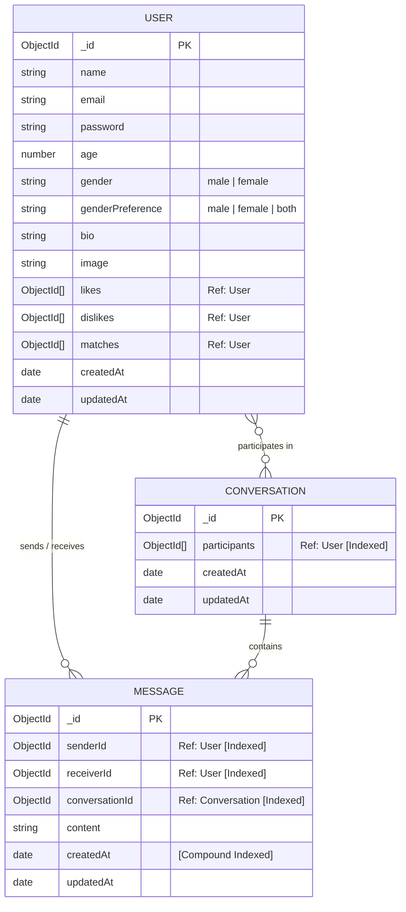

# 🔥 Tinder Clone (Web & Mobile Fullstack)

> **실시간 상호 매칭 및 1:1 라이브 채팅을 제공하는 풀스택 틴더(Tinder) 클론 애플리케이션입니다.**  
> 직관적인 스와이프 인터랙션, Socket.IO 기반 실시간 통신, Cloudinary 프로필 사진 관리, 그리고 Render.com 배포 및 무료 티어 슬립 방지 기능까지 완벽하게 통합되어 있습니다.

---

## 📌 목차
1. [🌟 서비스 개요 및 주요 기능](#1-서비스-개요-및-주요-기능)
2. [🛠️ 기술 스택 (Tech Stack)](#2-기술-스택-tech-stack)
3. [📁 프로젝트 디렉토리 구조 상세](#3-프로젝트-디렉토리-구조-상세)
4. [🗄️ 데이터베이스 모델 (MongoDB Schemas)](#4-데이터베이스-모델-mongodb-schemas)
5. [⚡ 실시간 웹소켓 (Socket.IO) 이벤트 구조](#5-실시간-웹소켓-socketio-이벤트-구조)
6. [📡 백엔드 REST API 엔드포인트](#6-백엔드-rest-api-엔드포인트)
7. [💻 로컬 개발 환경 설치 및 실행 가이드](#7-로컬-개발-환경-설치-및-실행-가이드)
8. [🚀 Render.com 클라우드 배포 및 슬립 방지](#8-rendercom-클라우드-배포-및-슬립-방지)

---

## 1. 🌟 서비스 개요 및 주요 기능

| 기능 분류 | 상세 설명 |
|---|---|
| **🔐 사용자 인증 & 보안** | • JWT 기반의 안전한 `httpOnly` 쿠키 인증<br>• `bcryptjs`를 통한 비밀번호 단방향 암호화<br>• 나이(18~100세), 성별, 선호 성별에 따른 추천 필터링 |
| **💖 스와이프 & 매칭 시스템** | • 마우스 드래그 및 모바일 터치 스와이프 인터랙션 지원<br>• 오른쪽 스와이프(LIKE) / 왼쪽 스와이프(NOPE) 제스처 및 스탬프 애니메이션<br>• 상호 좋아요 발생 시 즉각적인 **매칭(Match) 성사 및 축하 팝업** 제공 |
| **💬 실시간 1:1 채팅** | • **Socket.IO** 기반의 지연 없는 실시간 메시지 송수신<br>• 실시간 유저 접속(온라인/오프라인) 상태 표시 뱃지<br>• 새 메시지 도착 시 **종이비행기(✈️) 알림 뱃지 및 토스트 알림**<br>• 빠른 답장을 위한 추천 이모지 바 제공 |
| **🖼️ 프로필 & 이미지 관리** | • **Cloudinary API**를 통한 고화질 프로필 사진 업로드 및 최적화 호스팅<br>• 자기소개(Bio), 나이, 관심사 등 상세 프로필 수정 기능 |
| **📱 반응형 UI & 모바일 최적화** | • 모바일 화면을 위한 'Discover(탐색)' / 'Matches(매치목록)' 하단/상단 탭 전환<br>• Tailwind CSS 기반 모던 Glassmorphism 디자인 |
| **⏰ Render 슬립 방지 (Keep-Alive)** | • Render 무료 티어의 15분 비활성 슬립을 방지하는 **14분 주기 Cron 헬스체크** 내장 |

---

## 2. 🛠️ 기술 스택 (Tech Stack)

### 🖥️ Frontend (Web)
- **Core**: React 19 (Functional Components, Hooks)
- **Build Tool**: Vite
- **Styling**: Tailwind CSS v4, Lucide React (아이콘)
- **State Management**: Zustand (전역 상태 관리)
- **Routing**: React Router DOM v7
- **HTTP Client**: Axios (인터셉터 및 쿠키 자격증명 포함)
- **Realtime**: Socket.IO Client
- **Notifications**: React Hot Toast

### ⚙️ Backend
- **Runtime**: Node.js (ES Modules, `type: "module"`)
- **Framework**: Express.js v5
- **Database / ODM**: MongoDB Atlas + Mongoose v9
- **Authentication**: JSON Web Tokens (`jsonwebtoken`), `cookie-parser`, `bcryptjs`
- **File & Media**: Cloudinary SDK (이미지 업로드 및 삭제)
- **Realtime Server**: Socket.IO v4
- **Scheduler**: `cron` (14분 간격 자동 Keep-Alive Ping)
- **CORS / Config**: `cors`, `dotenv`

---

## 3. 📁 프로젝트 디렉토리 구조 상세

```
webMobile-tinder/
├── package.json              # 루트 패키지 설정 (통합 빌드 및 실행 스크립트)
├── render.md                 # Render.com 상세 배포 가이드 문서
├── README.md                 # 본 프로젝트 종합 안내 문서
│
├── backend/                  # 백엔드 서버 소스코드
│   ├── package.json          # 백엔드 의존성 관리
│   ├── .env                  # 백엔드 환경 변수 (포트, DB주소, JWT, Cloudinary 등)
│   └── src/
│       ├── server.js         # 백엔드 진입점 (Express, Socket.IO, 정적파일 서빙, DB연결)
│       ├── controllers/      # API 비즈니스 로직
│       │   ├── auth.controller.js     # 회원가입, 로그인, 로그아웃, 세션확인
│       │   ├── match.controller.js    # 스와이프, 추천 프로필, 매치 목록 조회
│       │   ├── message.controller.js  # 대화방 및 1:1 메시지 송수신
│       │   └── user.controller.js     # 프로필 정보 및 사진 업데이트
│       ├── middleware/
│       │   └── auth.middleware.js     # JWT 쿠키 검증 및 라우트 보호 미들웨어
│       ├── models/          # Mongoose 데이터베이스 스키마
│       │   ├── user.model.js          # 사용자 모델 (likes, dislikes, matches)
│       │   ├── message.model.js       # 메시지 모델 (복합 인덱스 적용)
│       │   └── conversation.model.js  # 대화방 모델 (참여자 인덱스 적용)
│       ├── routes/          # Express API 라우터 정의
│       │   ├── auth.route.js          # /api/auth 라우트
│       │   ├── match.route.js         # /api/matches 라우트
│       │   ├── message.route.js       # /api/messages 라우트
│       │   └── user.route.js          # /api/users 라우트
│       ├── socket/
│       │   └── socket.server.js       # Socket.IO 서버 설정 및 실시간 유저 매핑
│       └── utils/           # 공통 유틸리티
│           ├── connDB.js              # MongoDB 연결 헬퍼
│           ├── cron.js                # Render 14분 Keep-Alive 크론 작업
│           ├── file.utils.js          # Cloudinary 업로드/삭제 유틸리티
│           └── generateToken.js       # JWT 생성 및 쿠키 발급 유틸리티
│
├── frontend/                 # 프론트엔드 웹 소스코드
│   ├── package.json          # 프론트엔드 의존성 관리
│   ├── vite.config.js        # Vite 번들러 설정
│   ├── index.html            # SPA 메인 HTML
│   └── src/
│       ├── main.jsx          # React 앱 진입점
│       ├── App.jsx           # 메인 라우팅, 전역 레이아웃 및 소켓 리스너 연결
│       ├── index.css         # Tailwind CSS 전역 스타일
│       ├── pages/            # 주요 화면 컴포넌트
│       │   ├── HomePage.jsx           # 메인 스와이프 카드 및 매치 사이드바/모바일탭
│       │   ├── AuthPage.jsx           # 로그인 / 회원가입 전환 폼 화면
│       │   ├── ChatPage.jsx           # 1:1 실시간 대화창 화면
│       │   └── ProfilePage.jsx        # 프로필 정보 및 사진 수정 화면
│       ├── components/       # 재사용 UI 컴포넌트
│       │   ├── Header.jsx             # 상단 네비게이션 & 모바일 풀스크린 드로어
│       │   ├── Sidebar.jsx            # 매치 목록 및 실시간 온라인 상태 사이드바
│       │   ├── SwipeCard.jsx          # 스와이프 제스처 카드 인터랙션 컴포넌트
│       │   ├── NoMoreProfiles.jsx     # 추천 프로필 소진 시 표시 화면
│       │   ├── LoginForm.jsx          # 로그인 입력 폼
│       │   ├── SignUpForm.jsx         # 회원가입 입력 폼
│       │   └── chat/                  # 채팅 전용 컴포넌트
│       │       ├── ChatHeader.jsx     # 상대방 프로필 정보 및 실시간 상태 헤더
│       │       ├── MessageList.jsx    # 대화 말풍선 목록 및 자동 스크롤
│       │       └── MessageInput.jsx   # 메시지 전송 및 빠른 이모지 입력창
│       ├── store/            # Zustand 전역 상태 저장소
│       │   ├── useAuthStore.js        # 유저 인증, 로그인 세션, 소켓 초기화 관리
│       │   ├── useMatchStore.js       # 추천 프로필 탐색, 스와이프, 매칭 상태 관리
│       │   ├── useMessageStore.js     # 실시간 메시지 송수신 및 읽지않음(✈️) 관리
│       │   └── useUserStore.js        # 프로필 업데이트 처리
│       ├── socket/
│       │   └── socket.client.js       # Socket.IO 클라이언트 인스턴스 관리
│       └── lib/
│           └── axios.js               # Axios 기본 설정 (개발/배포 모드 baseURL 자동 분기)
│
└── mobile/                   # 모바일(React Native/Expo) 확장 대비 폴더
```

---

## 4. 🗄️ 데이터베이스 모델 (MongoDB Schemas)



---

## 5. ⚡ 실시간 웹소켓 (Socket.IO) 이벤트 구조

| 이벤트 이름 (Event) | 방향 (Direction) | 데이터 페이로드 (Payload) | 설명 |
|---|:---:|---|---|
| `connection` | Client ➔ Server | `query: { userId }` | 클라이언트 접속 시 사용자 ID 매핑 및 온라인 등록 |
| `getOnlineUsers` | Server ➔ Client | `string[] (onlineUserIds)` | 현재 실시간 접속 중인 유저 ID 목록 브로드캐스트 |
| `newMessage` | Server ➔ Client | `Message Object` | 새 메시지 수신 시 상대방 소켓으로 실시간 전달 |
| `newMatch` | Server ➔ Client | `{ _id, name, image }` | 상호 좋아요 매치 성사 시 상대방에게 실시간 알림 전송 |
| `disconnect` | Client ➔ Server | `-` | 연결 종료 시 온라인 목록에서 제거 및 갱신 브로드캐스트 |

---

## 6. 📡 백엔드 REST API 엔드포인트

### 🔑 인증 (`/api/auth`)
- `POST /api/auth/signup`: 신규 회원가입 & 자동 로그인 토큰 발급
- `POST /api/auth/login`: 이메일/비밀번호 로그인
- `POST /api/auth/logout`: JWT 쿠키 삭제 및 로그아웃
- `GET /api/auth/me`: 현재 로그인한 사용자 정보 조회 (인증 확인)

### 💖 매칭 & 탐색 (`/api/matches`)
- `GET /api/matches/user-profiles`: 내 성별 선호도에 맞는 추천 상대 프로필 목록 조회
- `POST /api/matches/swipe-right/:likedUserId`: 특정 유저 좋아요(Like) 처리 및 상호 매칭 검사
- `POST /api/matches/swipe-left/:dislikedUserId`: 특정 유저 넘기기(Dislike) 처리
- `GET /api/matches`: 현재 나와 매칭된 사용자 목록 조회

### 💬 메시지 & 대화 (`/api/messages`)
- `POST /api/messages/send`: 특정 매칭 상대에게 1:1 메시지 전송
- `GET /api/messages/conversation/:userId`: 특정 사용자와의 전체 대화 내역 조회

### 👤 유저 & 프로필 (`/api/users`)
- `PUT /api/users/update`: 프로필 정보(이름, 나이, 소개, 사진 등) 수정
- `GET /api/users/:userId`: 특정 유저 상세 정보 조회

### 🩺 헬스체크 (`/api/health`)
- `GET /api/health`: 서버 상태 확인 및 Render 14분 Keep-Alive Ping 엔드포인트

---

## 7. 💻 로컬 개발 환경 설치 및 실행 가이드

### 1) 사전 요구사항
- Node.js (v18 이상 권장)
- MongoDB Atlas 계정 또는 로컬 MongoDB
- Cloudinary 계정

### 2) 저장소 클론 및 패키지 설치
```bash
# 1. 저장소 복제
git clone https://github.com/your-username/webMobile-tinder.git
cd webMobile-tinder

# 2. 백엔드 및 프론트엔드 의존성 일괄 설치
npm run build
```

### 3) 환경 변수 설정
`backend/.env` 파일을 생성하고 아래와 같이 설정합니다:

```env
PORT=3000
NODE_ENV=development
DEVELOPMENT_URL=http://localhost:5173

# MongoDB Atlas 연결 문자열
MONGO_URI=mongodb+srv://<username>:<password>@your-cluster.mongodb.net/tinder_db?retryWrites=true&w=majority

# JWT 비밀키
JWT_SECRET=your_jwt_secret_key_here

# Cloudinary 설정
CLOUDINARY_CLOUD_NAME=your_cloudinary_name
CLOUDINARY_API_KEY=your_cloudinary_api_key
CLOUDINARY_API_SECRET=your_cloudinary_api_secret
```

### 4) 로컬 개발 서버 실행
터미널을 2개 열거나 각각 백엔드와 프론트엔드를 실행합니다:

```bash
# [터미널 1] 백엔드 서버 실행 (http://localhost:3000)
npm run dev:backend

# [터미널 2] 프론트엔드 Vite 개발 서버 실행 (http://localhost:5173)
npm run dev:frontend
```

브라우저에서 `http://localhost:5173`으로 접속하여 테스트를 시작합니다.

---

## 8. 🚀 Render.com 클라우드 배포 및 슬립 방지

이 프로젝트는 **Render.com** 무료 웹 서비스에서 백엔드와 프론트엔드가 한 번에 배포되도록 완벽하게 구성되어 있습니다.

1. **GitHub 저장소 연결**: `webMobile-tinder` 선택
2. **Build & Start 명령어**:
   - **Build Command**: `npm run build`
   - **Start Command**: `npm start`
3. **14분 Cron Keep-Alive**:
   - Render 무료 티어의 15분 비활성 슬립 문제를 방지하기 위해 백엔드에 14분 주기 크론이 내장되어 있어 **24시간 빠른 응답 속도를 유지**합니다.

> 📖 **더욱 자세한 단계별 배포 설명서**는 루트 폴더의 **[render.md](./render.md)** 파일을 참고해주세요.

---

## 📄 라이선스 (License)
This project is licensed under the [ISC License](./package.json).

