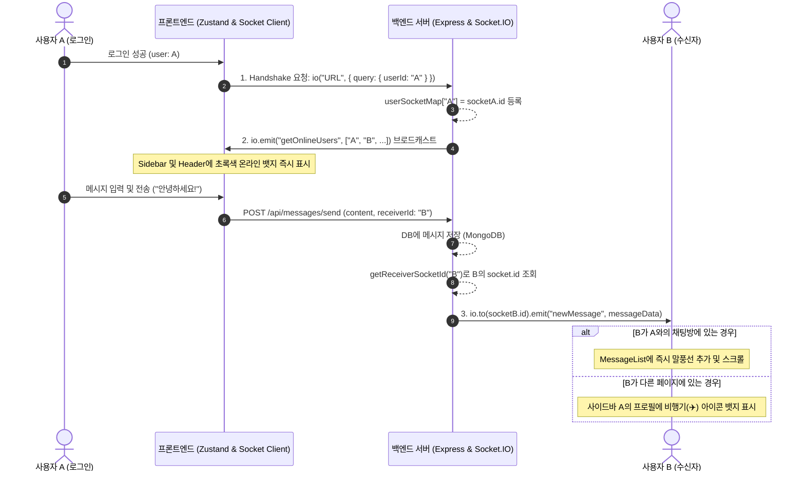

# ⚡ Socket.IO 실시간 통신 완벽 가이드 & 구현 정리

본 문서는 **Tinder 풀스택 웹 애플리케이션**에 구현된 **Socket.IO 실시간 웹소켓(WebSocket) 통신**의 아키텍처, 백엔드 및 프론트엔드 구현 코드, 동작 절차와 원리를 쉽게 정리한 가이드입니다.

---

## 📌 목차
1. [실시간 기능 개요 및 아키텍처](#1-실시간-기능-개요-및-아키텍처)
2. [백엔드(Backend) 구현 및 코드 분석](#2-백엔드backend-구현-및-코드-분석)
3. [프론트엔드(Frontend) 구현 및 코드 분석](#3-프론트엔드frontend-구현-및-코드-분석)
4. [프로젝트 내 4대 실시간 기능 동작 원리](#4-프로젝트-내-4대-실시간-기능-동작-원리)
5. [배포(Render.com) 및 CORS 최적화](#5-배포rendercom-및-cors-최적화)
6. [실전 동작 시나리오 예시](#6-실전-동작-시나리오-예시)

---

## 1. 실시간 기능 개요 및 아키텍처

### 🎯 구현된 4대 핵심 실시간 기능
1. **실시간 온라인/오프라인 상태 감지 (Online Status)**
   - 유저가 접속하거나 창을 닫으면 실시간으로 온라인 유저 목록을 모든 클라이언트에 브로드캐스트.
2. **1:1 실시간 채팅 메시지 송수신 (Real-time Chatting)**
   - 메시지 전송 시 새로고침 없이 수신자 화면에 말풍선이 즉시 렌더링되고 최하단으로 자동 스크롤.
3. **새로운 메시지 알림 & 사이드바 비행기 아이콘 (Unread Badge)**
   - 채팅방 밖(홈, 프로필, 타 대화방 등)에 있을 때 메시지를 받으면 사이드바 아바타와 이름 옆에 **비행기(✈️) 아이콘**과 뱃지가 깜빡이며 표시되고, 채팅방에 진입하면 즉시 해제.
4. **실시간 상호 매치 성사 알림 (New Match Notification)**
   - 상대방이 나에게 '좋아요'를 눌러 매치가 성사되면 실시간으로 토스트 팝업(`🎉 매치되었습니다!`)과 함께 매칭 목록이 즉시 동기화.

---

### 🔄 전체 실시간 통신 흐름도



---

## 2. 백엔드(Backend) 구현 및 코드 분석

### 📁 1) 서버 진입점 및 HTTP/Socket 바인딩 (`backend/src/server.js`)
Express 인스턴스와 Node.js의 `httpServer`를 결합하여 동일한 포트에서 HTTP API와 WebSocket을 함께 처리합니다.

```javascript
import express from "express";
import { createServer } from "http";
import { initializeSocket } from "./socket/socket.server.js";

const app = express();
const PORT = process.env.PORT || 3000;

// 1. HTTP 서버 생성 및 Socket.IO 초기화 바인딩
const httpServer = createServer(app);
initializeSocket(httpServer);

// 2. CORS 설정 (개발환경 및 프로덕션 동적 대응)
app.use(
  cors({
    origin:
      process.env.NODE_ENV === "production"
        ? process.env.CLIENT_URL || true
        : ["http://localhost:5173", "http://localhost:3000", process.env.DEVELOPMENT_URL].filter(Boolean),
    credentials: true,
  }),
);

// 3. app.listen() 대신 httpServer.listen() 사용 (WebSocket 요청 수신 필수)
connDB().then(() => {
  httpServer.listen(PORT, () => {
    console.log(`Server is running on port ${PORT}`);
  });
});
```

---

### 📁 2) Socket.IO 서버 핵심 로직 (`backend/src/socket/socket.server.js`)
접속한 유저의 식별자(`userId`)와 `socket.id`를 매핑하고 연결 수명 주기를 관리합니다.

```javascript
import { Server } from "socket.io";

let io;

// 접속 중인 유저 맵: { [userId]: socketId }
const userSocketMap = {};

// 특정 유저의 소켓 ID를 찾는 헬퍼 함수
export const getReceiverSocketId = (userId) => userSocketMap[userId];

// Socket.IO 인스턴스 반환 함수
export const getIO = () => {
  if (!io) throw new Error("Socket.IO is not initialized!");
  return io;
};

export const initializeSocket = (httpServer) => {
  io = new Server(httpServer, {
    cors: {
      origin:
        process.env.NODE_ENV === "production"
          ? process.env.CLIENT_URL || true
          : ["http://localhost:5173", "http://localhost:3000", process.env.DEVELOPMENT_URL].filter(Boolean),
      credentials: true,
    },
  });

  io.on("connection", (socket) => {
    // 1. Handshake 쿼리에서 userId 추출
    const userId = socket.handshake.query.userId;
    console.log(`⚡ Socket connected: ${socket.id} (User ID: ${userId || "Anonymous"})`);

    // 2. 유저 매핑 등록
    if (userId && userId !== "undefined") {
      userSocketMap[userId] = socket.id;
    }

    // 3. 전체 유저에게 현재 온라인 목록 브로드캐스트
    io.emit("getOnlineUsers", Object.keys(userSocketMap));

    // 4. 연결 해제 시 처리 (다중 탭 고려 검증)
    socket.on("disconnect", () => {
      console.log(`❌ Socket disconnected: ${socket.id}`);
      if (userId && userId !== "undefined" && userSocketMap[userId] === socket.id) {
        delete userSocketMap[userId];
      }
      // 갱신된 온라인 유저 목록 전송
      io.emit("getOnlineUsers", Object.keys(userSocketMap));
    });
  });

  return io;
};
```

---

### 📁 3) 컨트롤러에서의 실시간 이벤트 발송

#### ① 메시지 전송 시 (`backend/src/controllers/message.controller.js`)
```javascript
import { getReceiverSocketId, getIO } from "../socket/socket.server.js";

export const sendMessage = async (req, res) => {
  // DB에 메시지 생성
  const newMessage = await Message.create({ senderId, receiverId, content, conversationId });

  // 수신자가 온라인 상태이면 실시간 소켓 전송
  try {
    const receiverSocketId = getReceiverSocketId(receiverId.toString());
    if (receiverSocketId) {
      const io = getIO();
      io.to(receiverSocketId).emit("newMessage", newMessage);
    }
  } catch (socketError) {
    console.log("Socket emit error:", socketError.message);
  }

  res.status(201).json({ message: "Message sent successfully", newMessage });
};
```

#### ② 상호 매칭 성사 시 (`backend/src/controllers/match.controller.js`)
```javascript
import { getReceiverSocketId, getIO } from "../socket/socket.server.js";

// 양방향 좋아요가 성사되었을 때
if (likedUser.likes.includes(currentUser._id)) {
  currentUser.matches.push(likedUserId);
  likedUser.matches.push(currentUser._id);
  await Promise.all([currentUser.save(), likedUser.save()]);

  // 상대방이 접속 중이면 실시간 newMatch 이벤트 발송
  try {
    const receiverSocketId = getReceiverSocketId(likedUserId.toString());
    if (receiverSocketId) {
      const io = getIO();
      io.to(receiverSocketId).emit("newMatch", {
        _id: currentUser._id,
        name: currentUser.name,
        image: currentUser.image,
      });
    }
  } catch (socketError) {
    console.log("Socket emit error on match:", socketError.message);
  }
}
```

---

## 3. 프론트엔드(Frontend) 구현 및 코드 분석

### 📁 1) 소켓 클라이언트 싱글톤 인스턴스 (`frontend/src/socket/socket.client.js`)
```javascript
import { io } from "socket.io-client";

const SOCKET_URL =
  import.meta.env.VITE_SOCKET_URL ||
  (import.meta.env.MODE === "development" ? "http://localhost:3000" : "/");

let socket = null;

export const initializeSocket = (userId) => {
  if (socket) {
    if (socket.connected) return socket;
    socket.disconnect();
  }

  socket = io(SOCKET_URL, {
    query: { userId },
    withCredentials: true,
    autoConnect: true,
    reconnection: true,
    reconnectionAttempts: 5,
    reconnectionDelay: 1000,
    transports: ["websocket", "polling"],
  });

  return socket;
};

export const getSocket = () => socket;

export const disconnectSocket = () => {
  if (socket) {
    socket.disconnect();
    socket = null;
  }
};
```

---

### 📁 2) 인증 상태와 소켓 라이프사이클 연동 (`frontend/src/store/useAuthStore.js`)
로그인/인증 확인 시 자동으로 소켓을 연결하고, `getOnlineUsers`를 구독하여 `onlineUsers` 배열을 실시간 유지합니다.

```javascript
export const useAuthStore = create((set, get) => ({
  user: null,
  isAuthenticated: false,
  onlineUsers: [],
  socket: null,

  connectSocket: () => {
    const { user } = get();
    if (!user?._id) return;

    const socket = initializeSocket(user._id);
    set({ socket });

    socket.on("getOnlineUsers", (users) => {
      set({ onlineUsers: users });
    });
  },

  disconnectSocket: () => {
    disconnectSocket();
    set({ socket: null, onlineUsers: [] });
  },

  login: async (email, password) => {
    const response = await axiosInstance.post("/auth/login", { email, password });
    set({ user: response.data, isAuthenticated: true });
    get().connectSocket(); // 소켓 자동 연결
  },

  logout: async () => {
    await axiosInstance.post("/auth/logout");
    get().disconnectSocket(); // 소켓 자동 해제
    set({ user: null, isAuthenticated: false });
  },

  checkAuth: async () => {
    const response = await axiosInstance.get("/auth/me");
    set({ user: response.data.user, isAuthenticated: true });
    get().connectSocket(); // 새로고침 시 세션 유지 & 소켓 재연결
  },
}));
```

---

### 📁 3) 전역 메시지 및 안 읽은 메시지(비행기 아이콘) 상태 관리 (`frontend/src/store/useMessageStore.js`)
```javascript
export const useMessageStore = create((set, get) => ({
  messages: [],
  unreadSenders: [],       // 안 읽은 메시지를 보낸 유저 ID 목록
  activeChatUserId: null,  // 현재 열려있는 대화방 상대방 ID

  setActiveChatUserId: (userId) => {
    set({ activeChatUserId: userId });
    if (userId) get().markAsRead(userId);
  },

  markAsRead: (userId) => {
    set((state) => ({
      unreadSenders: state.unreadSenders.filter((id) => id !== userId),
    }));
  },

  subscribeToGlobalMessages: () => {
    const socket = getSocket();
    if (!socket) return;

    socket.off("newMessage");
    socket.on("newMessage", (newMessage) => {
      const senderId = typeof newMessage.senderId === "object" ? newMessage.senderId._id : newMessage.senderId;

      // 내가 보낸 메시지 무시
      if (useAuthStore.getState().user?._id === senderId) return;

      const { activeChatUserId, unreadSenders } = get();

      // 현재 해당 상대와의 대화방을 보고 있는 경우 -> 즉시 메시지 렌더링
      if (activeChatUserId && activeChatUserId === senderId) {
        set((state) => ({ messages: [...state.messages, newMessage] }));
      } else {
        // 다른 화면에 있는 경우 -> 비행기 아이콘 표시 목록에 추가 & 토스트 팝업
        if (!unreadSenders.includes(senderId)) {
          set({ unreadSenders: [...unreadSenders, senderId] });
        }
        toast("✈️ 새로운 메시지가 도착했습니다!", { duration: 3000 });
      }
    });
  },
}));
```

---

## 4. 프로젝트 내 4대 실시간 기능 동작 원리

### 1) 🟢 실시간 온라인 상태 표시 UI (`Sidebar.jsx` & `ChatHeader.jsx`)
```jsx
// 1. 매칭 상대가 온라인 목록(onlineUsers)에 있는지 검사
const isOnline = onlineUsers.includes(match._id);

// 2. 초록색 핑(Ping) 펄스 뱃지 렌더링
{isOnline ? (
  <span className="absolute -bottom-0.5 -right-0.5 flex h-3.5 w-3.5">
    <span className="animate-ping absolute inline-flex h-full w-full rounded-full bg-emerald-400 opacity-75"></span>
    <span className="relative inline-flex rounded-full h-3.5 w-3.5 bg-emerald-500 border-2 border-white shadow-xs"></span>
  </span>
) : (
  <span className="absolute -bottom-0.5 -right-0.5 inline-flex rounded-full h-3.5 w-3.5 bg-gray-300 border-2 border-white shadow-xs"></span>
)}
```

---

### 2) ✈️ 안 읽은 메시지 비행기 아이콘 표시 UI (`Sidebar.jsx`)
```jsx
// 1. 해당 유저가 unreadSenders에 포함되어 있는지 검사
const hasUnread = unreadSenders.includes(match._id);

// 2. 아바타 좌측 상단 통통 튀는 바운스 비행기 아이콘 렌더링
{hasUnread && (
  <div className="absolute -top-1 -left-1 w-5 h-5 rounded-full bg-linear-to-tr from-pink-500 to-rose-600 text-white flex items-center justify-center shadow-md animate-bounce">
    <Send className="w-2.5 h-2.5 fill-white text-white rotate-45 translate-x-[-0.5px] translate-y-[-0.5px]" />
  </div>
)}

// 3. 이름 옆 '새 메시지' 뱃지 렌더링
{hasUnread && (
  <span className="inline-flex items-center gap-1 text-[10px] font-bold text-rose-600 bg-white px-1.5 py-0.5 rounded-full border border-rose-200 shadow-xs shrink-0">
    <Send className="w-2.5 h-2.5 fill-rose-500 text-rose-500 rotate-45" />
    새 메시지
  </span>
)}
```

---

### 3) 💖 실시간 상호 매치 알림 (`useMatchStore.js` & `App.jsx`)
```javascript
// App.jsx에서 소켓 연결 시 자동 구독
socket.on("newMatch", (newMatchUser) => {
  toast.success(`🎉 ${newMatchUser.name}님과 새로운 매치가 성사되었습니다!`, {
    icon: "💖",
    duration: 5000,
  });
  getMyMatches(); // 사이드바 매칭 목록 자동 새로고침
});
```

---

## 5. 배포(Render.com) 및 CORS 최적화

백엔드와 프론트엔드를 Render.com에 단일 서비스(Monolith)로 묶어서 배포할 때:
- 브라우저가 보는 출처와 API/웹소켓 출처가 동일한 **Same-Origin** 환경이 됩니다.
- `.env`에 `CLIENT_URL`을 적지 않아도 동작하도록 `process.env.CLIENT_URL || true` 패턴을 적용했습니다.

```javascript
cors: {
  origin:
    process.env.NODE_ENV === "production"
      ? process.env.CLIENT_URL || true // 배포 시 도메인 자동 허용
      : ["http://localhost:5173", "http://localhost:3000", process.env.DEVELOPMENT_URL].filter(Boolean),
  credentials: true,
}
```

---

## 6. 실전 동작 시나리오 예시

| 단계 | 사용자 A (철수) | 사용자 B (영희) | 시스템/소켓 동작 |
|:---:|:---|:---|:---|
| **1** | 앱에 로그인 | 앱에 로그인 중 | 둘 다 `initializeSocket` 실행 → 서로의 사이드바에 **초록색 점(온라인)** 표시 |
| **2** | 영희 프로필 카드를 오른쪽으로 스와이프 (Like) | 홈 화면 탐색 중 | 영희도 철수를 좋아한 상태였다면 백엔드에서 `newMatch` 이벤트 발송 → 영희 화면에 `🎉 철수님과 매치되었습니다!` 팝업 및 목록 즉시 갱신 |
| **3** | 영희와의 채팅방에서 `"안녕하세요!"` 전송 | 홈 화면(채팅방 밖)에 머무름 | 백엔드가 영희의 `socket.id`로 `newMessage` 전송 → 영희 사이드바의 철수 프로필에 **✈️ 비행기 아이콘**과 `새 메시지` 뱃지 깜빡임 |
| **4** | 대기 중 | 사이드바의 철수 클릭하여 채팅방 진입 | 영희의 `activeChatUserId`가 철수로 설정되면서 `markAsRead` 실행 → **비행기 아이콘 즉시 소멸** 및 실시간 대화 이어짐 |

---

✅ 본 프로젝트의 모든 실시간 통신 파이프라인은 견고하고 최적화된 상태로 동작합니다.
